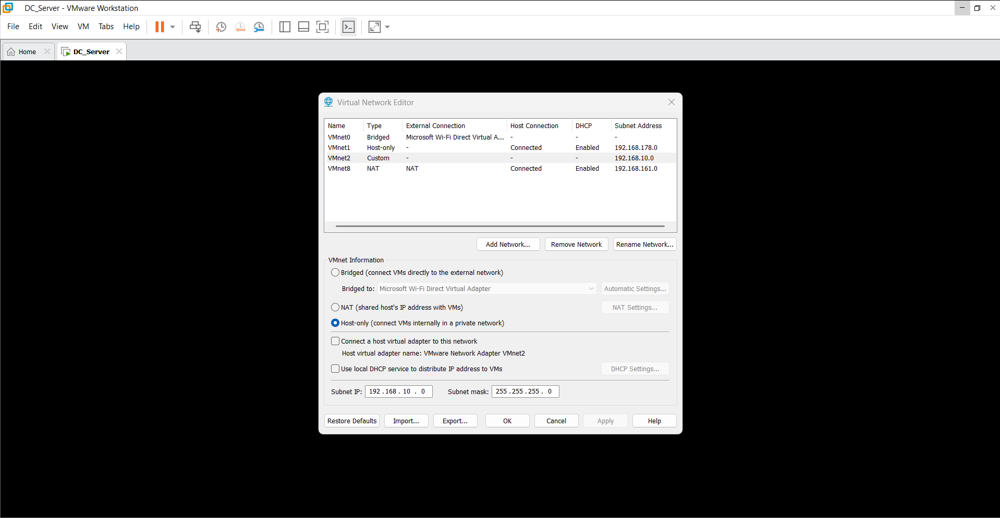
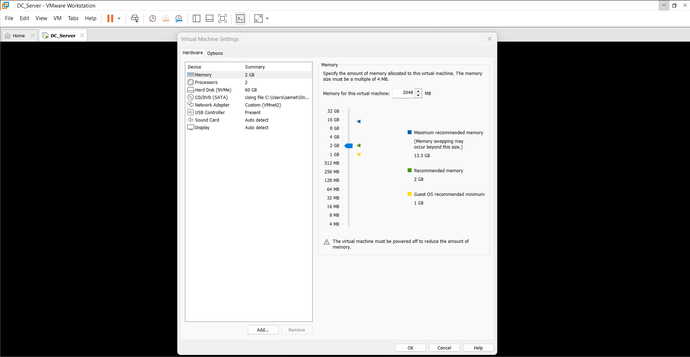
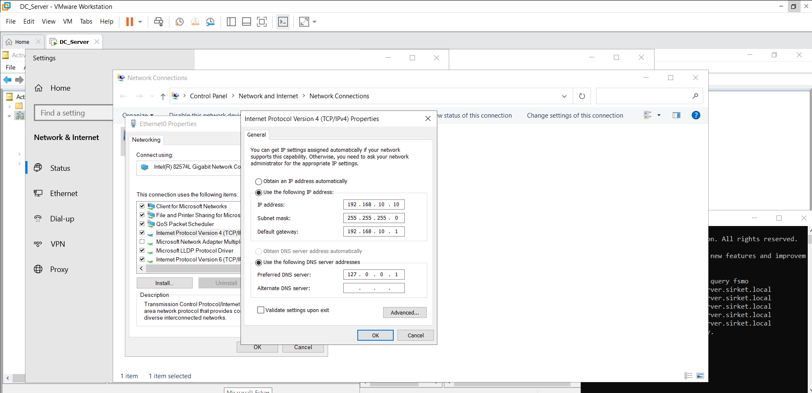
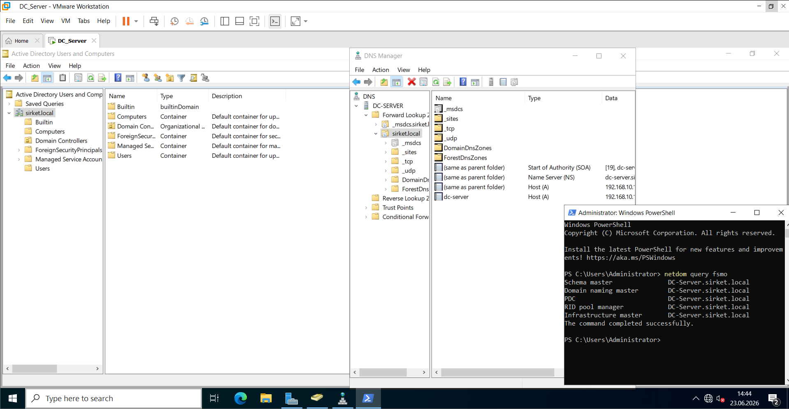

1. VMware Virtual Network Configurations / Sanal Ağ Yapılandırması

\*\*English:\*\*

To ensure isolated and secure communications across my infrastructure, I provisioned a dedicated host-only virtual network (`VMnet2`) using the VMware Workstation Virtual Network Editor. I designated the subnet as `192.168.10.0/24`. Crucially, I explicitly disabled VMware's internal DHCP service for this subnet. This design standard allows me to prevent IP conflicts and guarantees that my enterprise Windows Server DHCP infrastructure—which I scheduled for later deployment—maintains sole authority over dynamic IP provisioning across the domain.

\*\*Türkçe:\*\*

Altyapım genelinde yalıtılmış ve güvenli iletişimi sağlamak amacıyla, VMware Workstation Sanal Ağ Editörü'nü kullanarak özel bir host-only sanal ağ (`VMnet2`) yapılandırdım. Alt ağı `192.168.10.0/24` olarak belirledim. IP çakışmalarını önlemek ve projenin ilerleyen aşamalarında kuracağım kurumsal Windows Server DHCP servisinin ağ üzerinde tek yetkili olmasını sağlamak amacıyla, VMware'in yerel DHCP hizmetini bu alt ağ için özellikle devre dışı bıraktım.

\---

2. Domain Controller Settings \& Baseline OS Configuration / Sunucu Ayarları ve Temel Yapılandırma

\*\*English:\*\*

I deployed my core infrastructure instance, `DC_Server`, using a manual installation sequence of Windows Server 2022 Standard (Desktop Experience) to ensure strict configuration control. I applied baseline configurations following strict corporate naming conventions. I optimized the hardware specifications to balance my 16GB physical host constraint, provisioning 2 GB of RAM and 2 CPU cores, which comfortably meets the requirements for my core Active Directory Domain Services (AD DS) and DNS server roles.

\*\*Türkçe:\*\*

Altyapımın kalbini oluşturan `DC_Server` sunucumu, tam yapılandırma kontrolü sağlamak amacıyla Windows Server 2022 Standard (Masaüstü Deneyimi) imajı ile manuel olarak kurdum. Temel sistem ayarlarını, kurumsal isimlendirme standartlarına uygun olarak gerçekleştirdim. Donanım kaynaklarımı, 16 GB fiziksel ana bilgisayar kısıtlamamı dengeleyecek şekilde 2 GB RAM ve 2 işlemci çekirdeği olarak optimize ettim; bu kaynak miktarı kurduğum Active Directory Etki Alanı Hizmetleri (AD DS) ve DNS sunucu rolleri için tam kararlılık sağlamaktadır.

\---

3. Static IP Assignment \& Networking Parameters / Statik IP ve Ağ Bilgileri

\*\*English:\*\*

A deterministic networking topology is mandatory for directory service health, so I bound a persistent static IPv4 address configuration to the primary interface of my `DC_Server` server. I defined the network parameters with IP address `192.168.10.10`, subnet mask `255.255.255.0`, and gateway `192.168.10.1`. I pointed the Preferred DNS parameter directly to the loopback address (`127.0.0.1`), routing all name resolution traffic through my own local DNS zone database immediately upon active domain promotion.

\*\*Türkçe:\*\*

Dizin hizmetlerinin kararlılığı ve erişilebilirliği için sunucumun sabit bir IP adresine sahip olması zorunluydu. Bu doğrultuda, `DC_Server` sunucumun birincil ağ arayüzüne kalıcı statik IPv4 yapılandırmasını uyguladım. Ağ parametrelerini IP adresi `192.168.10.10`, alt ağ maskesi `255.255.255.0` ve ağ geçidi `192.168.10.1` olarak tanımladım. Birincil DNS adresini, döngüsel geri besleme (loopback) adresi olan `127.0.0.1` olarak ayarlayarak sunucumun etki alanı yükseltilmesi sonrasında tüm ad çözümleme isteklerini kendi yerel DNS veritabanım üzerinden yürütmesini sağladım.

\---

4. Active Directory Domain Promotion \& Service Verification / Domain Kurulumu ve Servis Doğrulama

\*\*English:\*\*

I successfully promoted my server to a Forest Root Domain Controller, establishing the internal namespace `sirket.local`. Following the promotion, I verified the installation by checking three critical areas on a single screen. First, I validated that the Active Directory installation was completed and running correctly. Second, I opened DNS Manager and confirmed that the automated Active Directory-integrated DNS zones, including the critical `_msdcs.sirket.local` zone, were created properly. Finally, I executed the administrative query `netdom query fsmo` via the command line. The output confirmed that all 5 Flexible Single Master Operation (FSMO) roles—Schema Master, Domain Naming Master, PDC Emulator, RID Pool Manager, and Infrastructure Master—are successfully assigned to my `DC_Server` server. This validation proves that the system is fully operational and healthy.

\*\*Türkçe:\*\*

Sunucumu, `sirket.local` iç ağ etki alanı adını barındıracak şekilde başarıyla Orman Kökü Etki Alanı Denetleyicisi (Forest Root Domain Controller) rolüne yükselttim. Kurulum sonrasında, sistemin doğruluğunu tek bir ekran üzerinde üç kritik noktayı kontrol ederek doğruladım. İlk olarak, Active Directory kurulumunun tamamlandığını ve sorunsuz çalıştığını kontrol ettim. İkinci olarak, DNS Manager (DNS Yöneticisi) arayüzünü açarak Active Directory ile entegre çalışan DNS alanlarını inceledim ve sistem için hayati önem taşıyan `_msdcs.sirket.local` bölgesi dahil tüm kayıtların otomatik olarak oluştuğunu onayladım. Son olarak, komut satırı üzerinden `netdom query fsmo` komutunu çalıştırdım. Bu komutun çıktısıyla 5 FSMO rolünün (Schema Master, Domain Naming Master, PDC Emulator, RID Pool Manager ve Infrastructure Master) eksiksiz olarak `DC_Server` sunucum üzerinde barındırıldığını gördüm. Tüm bu adımlar, altyapının tamamen hazır ve sağlıklı çalıştığını kanıtlamaktadır.

