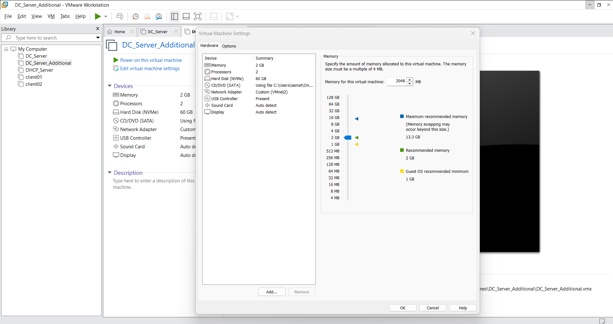
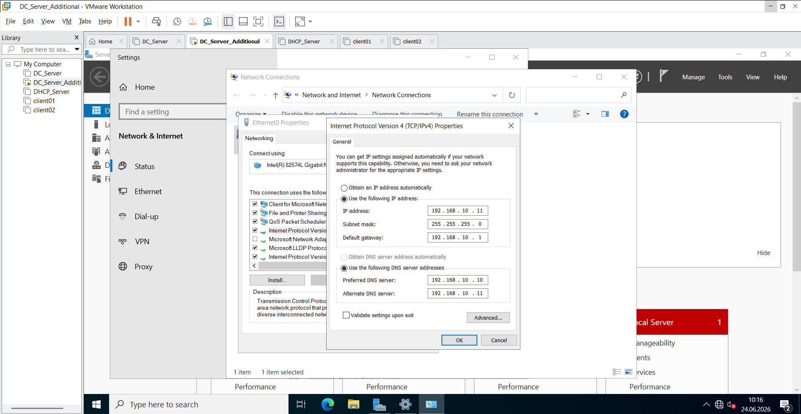
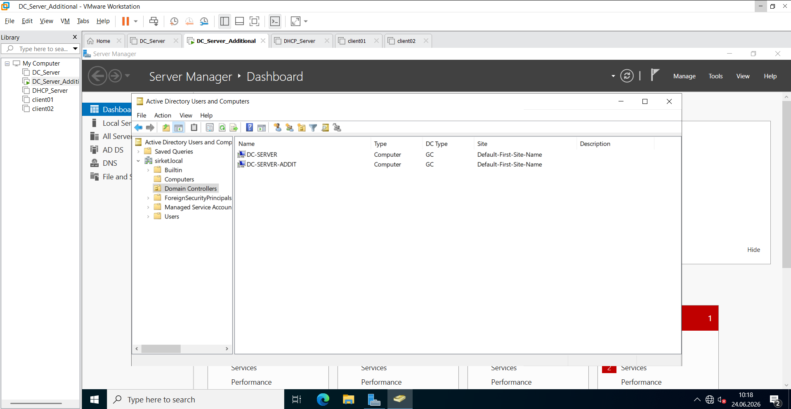
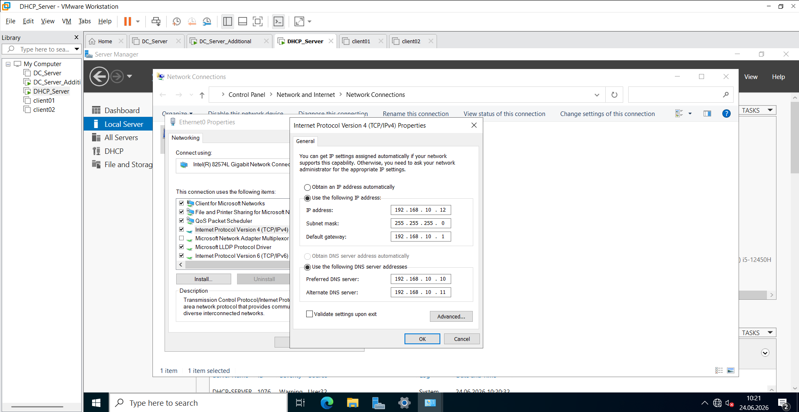
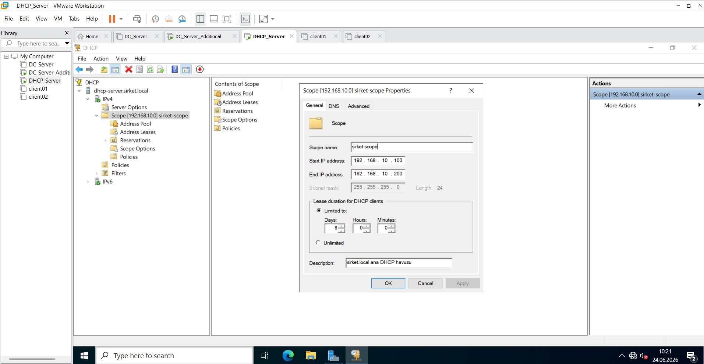
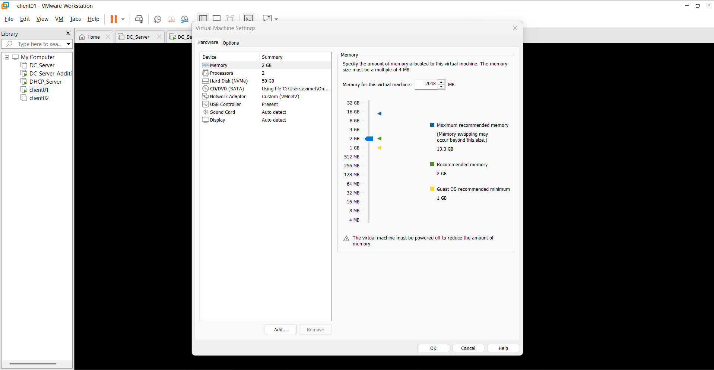
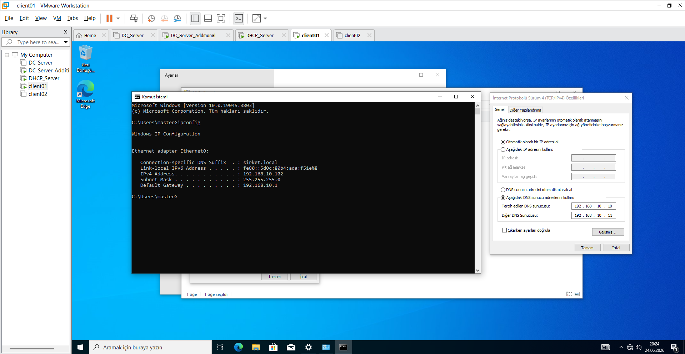
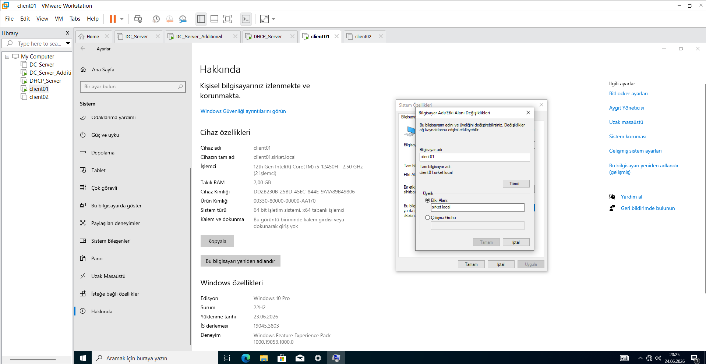
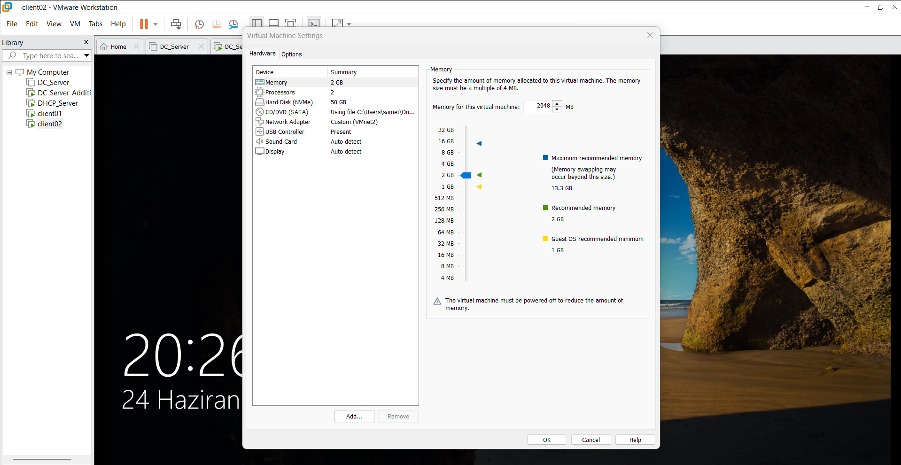
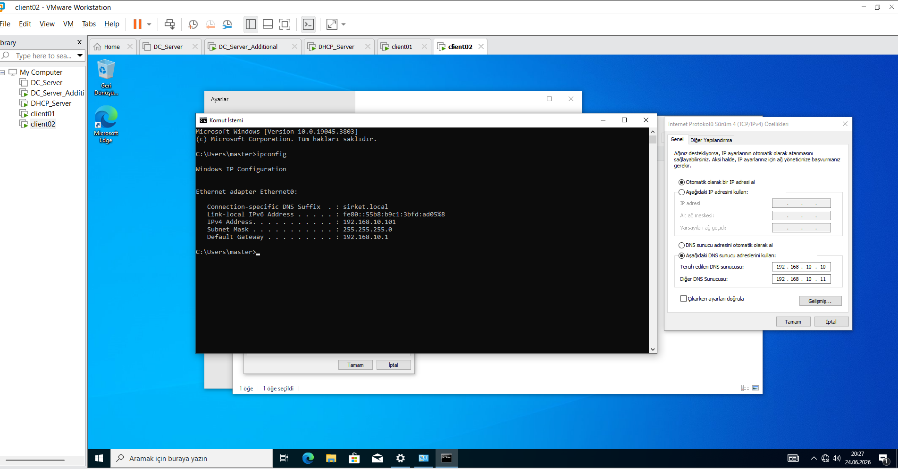

1. Secondary Domain Controller (DC_Server_Additional) Deployment / Yedek Domain Controller Kurulumu

Aşağıdaki görseller sırasıyla: Üstte tek satırda DC_Server_Additional sanal makine özelliklerini; altta yan yana ise statik IP yapılandırmasını ve Active Directory replikasyon doğrulamasını göstermektedir.
The images below display: On top, DC_Server_Additional VM hardware specifications; below side-by-side, static IP configuration and Active Directory replication verification.

<table width="100%" style="border-collapse: collapse; border: none;">
  <tr style="border: none;">
    <td colspan="2" style="width: 100%; padding: 4px; border: none;">
      
    </td>
  </tr>
  <tr style="border: none;">
    <td style="width: 50%; padding: 4px; border: none;">
      
    </td>
    <td style="width: 50%; padding: 4px; border: none;">
      
    </td>
  </tr>
</table>

**English:** I deployed my secondary domain controller, `DC_Server_Additional`, using Windows Server 2022 to provide high availability and redundancy for my environment. I allocated 2 GB of RAM and 2 CPU cores to match my primary domain controller. I assigned a persistent static IP address of `192.168.10.11` and pointed its preferred DNS server directly to `DC_Server` (`192.168.10.10`) to facilitate the initial domain join. After joining the server to the `sirket.local` domain, I promoted it to an Additional Domain Controller, enabling both DNS and Global Catalog roles. I verified that the Active Directory database replication between `DC_Server` and `DC_Server_Additional` is fully functional and healthy.

**Türkçe:** Ortamımda yüksek kullanılabilirlik ve yedeklilik sağlamak amacıyla Windows Server 2022 kullanarak ikinci domain controller olan `DC_Server_Additional` sunucumu kurdum. Birincil sunucumla uyumlu olması için bu makineye de 2 GB RAM ve 2 işlemci çekirdeği atadım. Sunucuya statik olarak `192.168.10.11` IP adresini tanımladım ve domain join işleminin sorunsuz gerçekleşmesi için birincil DNS sunucusu olarak `DC_Server` sunucumu (`192.168.10.10`) gösterdim. Sunucuyu `sirket.local` domainine dahil ettikten sonra Additional Domain Controller olarak yükselttim; DNS ve Global Catalog rollerini aktif hale getirdim. Kurulum sonunda `DC_Server` ile `DC_Server_Additional` arasındaki Active Directory replikasyonunun eksiksiz ve sorunsuz çalıştığını doğruladım.

---

2. DHCP Server Configuration & Scope Management / DHCP Sunucu ve Scope Yapılandırması

Aşağıdaki görseller sırasıyla: Üstte tek satırda DHCP_Server sanal makine özelliklerini; altta yan yana ise statik IP yapılandırmasını ve aktif DHCP Scope yapısını göstermektedir.
The images below display: On top, DHCP_Server VM hardware specifications; below side-by-side, static IP configuration and the active DHCP Scope architecture.

<table width="100%" style="border-collapse: collapse; border: none;">
  <tr style="border: none;">
    <td colspan="2" style="width: 100%; padding: 4px; border: none;">
      
    </td>
  </tr>
  <tr style="border: none;">
    <td style="width: 50%; padding: 4px; border: none;">
      
    </td>
    <td style="width: 50%; padding: 4px; border: none;">
      
    </td>
  </tr>
</table>

**English:** I dedicated a separate standalone instance named `DHCP_Server` for network address automation, provisioning it with 1 GB of RAM and 40 GB of storage. I assigned a static IP address of `192.168.10.12` and pointed its DNS settings to both `DC_Server` and `DC_Server_Additional` for failover safety before successfully joining it to the domain. After installing the DHCP Server role, I created a dynamic IP deployment scope ranging from `192.168.10.100` to `192.168.10.200` with an 8-day lease time. Finally, I authorized this DHCP server within Active Directory to ensure it can legally assign IP addresses on the network.

**Türkçe:** Ağ üzerindeki adres yönetimini otomatikleştirmek için `DHCP_Server` adında bağımsız bir sunucu hazırladım ve sisteme 1 GB RAM ile 40 GB depolama alanı atadım. Sunucuya statik olarak `192.168.10.12` IP adresini verdim; domain join öncesinde DNS olarak hem `DC_Server` hem de `DC_Server_Additional` sunucularımı tanımladım. Sunucuyu domaine ekledikten sonra DHCP Server rolünü kurdum. İstemci makineler için `192.168.10.100` ile `192.168.10.200` aralığını kapsayan ve kira süresi 8 gün olan bir DHCP Scope yapısı oluşturdum. Son adım olarak, ağda yetkisiz IP dağıtılmasını engellemek için bu DHCP sunucusunu Active Directory üzerinde başarıyla yetkilendirdim (Authorize ettim).

---

3. CLIENT01 Windows 10 Pro Installation & Domain Join / CLIENT01 Kurulumu ve Domaine Alınması

Aşağıdaki görseller sırasıyla: Üstte tek satırda CLIENT01 sanal makine özelliklerini; altta yan yana ise DHCP'den aldığı IP bilgisini ve sirket.local domainine katıldığının kanıtını göstermektedir.
The images below display: On top, CLIENT01 VM hardware specifications; below side-by-side, dynamic IP lease from DHCP and proof of successful join to sirket.local domain.

<table width="100%" style="border-collapse: collapse; border: none;">
  <tr style="border: none;">
    <td colspan="2" style="width: 100%; padding: 4px; border: none;">
      
    </td>
  </tr>
  <tr style="border: none;">
    <td style="width: 50%; padding: 4px; border: none;">
      
    </td>
    <td style="width: 50%; padding: 4px; border: none;">
      
    </td>
  </tr>
</table>

**English:** I deployed `CLIENT01` running Windows 10 Pro, assigning it 2 GB of RAM and 50 GB of disk space to stay within host performance limits. During initial configuration, I created a fallback local administrator account. Once connected to `VMnet2`, the machine automatically acquired an IP address from my authorized DHCP server. Using the active domain administrator credentials, I successfully joined `CLIENT01` to the `sirket.local` infrastructure and verified its active computer object placement in the directory.

**Türkçe:** Ana bilgisayarımın performansını korumak adına `CLIENT01` isimli sanal makineme Windows 10 Pro işletim sistemi kurarak 2 GB RAM ve 50 GB disk alanı tahsis ettim. İlk kurulum sırasında olası sorunlara karşı yerel bir admin hesabı oluşturdum. Makineyi `VMnet2` ağına bağladığımda, kurduğum DHCP sunucusundan otomatik olarak uygun bir IP adresi almasını sağladım. Ardından domain yetkili bilgilerini girerek `CLIENT01` istemcisini `sirket.local` domainine başarıyla dahil ettim ve bilgisayar nesnesinin dizine eklendiğini tescilledim.

---

4. CLIENT02 Windows 10 Pro Cloning & Domain Join / CLIENT02 Klonlama ve Domaine Alınması

Aşağıdaki görseller sırasıyla: Üstte tek satırda CLIENT02 sanal makine özelliklerini; altta yan yana ise DHCP'den aldığı benzersiz IP bilgisini ve sirket.local domainine katıldığının kanıtını göstermektedir.
The images below display: On top, CLIENT02 VM hardware specifications; below side-by-side, unique dynamic IP lease from DHCP and proof of successful join to sirket.local domain.

<table width="100%" style="border-collapse: collapse; border: none;">
  <tr style="border: none;">
    <td colspan="2" style="width: 100%; padding: 4px; border: none;">
      
    </td>
  </tr>
  <tr style="border: none;">
    <td style="width: 50%; padding: 4px; border: none;">
      
    </td>
    <td style="width: 50%; padding: 4px; border: none;">
      
    </td>
  </tr>
</table>

**English:** To speed up procurement and simulate real-world operations, I deployed `CLIENT02` using VMware's cloning features with identical hardware specs (2 GB RAM, 50 GB Disk). To prevent network security identifiers conflicts, I ran the `sysprep` tool to generalize the OS before assigning its final configuration. The clone machine powered up on `VMnet2`, leased a unique dynamic IP address from the DHCP server, and was successfully joined to the `sirket.local` enterprise domain infrastructure as a separate, authenticated endpoint.

**Türkçe:** Zaman kazanmak ve gerçek saha operasyonlarını simüle etmek amacıyla, `CLIENT02` istemcisini ilk makineden VMware klonlama (clone) yöntemini kullanarak aynı donanım özellikleriyle (2 GB RAM, 50 GB Disk) oluşturdum. Ağda SID (Güvenlik Tanımlayıcısı) çakışması yaşamamak için bilgisayarı domaine almadan önce `sysprep` aracını çalıştırarak işletim sistemini sıfırladım ve özelleştirdim. `VMnet2` üzerinde açılan klon makine, DHCP sunucusundan kendisine ait benzersiz bir dinamik IP aldı ve ardından `sirket.local` kurumsal domain altyapısına bağımsız bir üye olarak başarıyla dahil edildi.