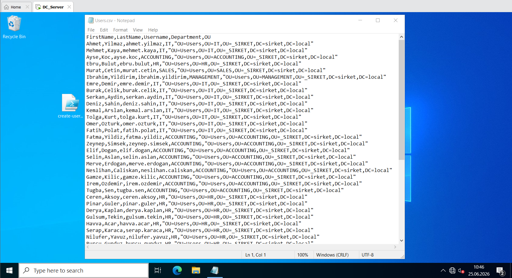
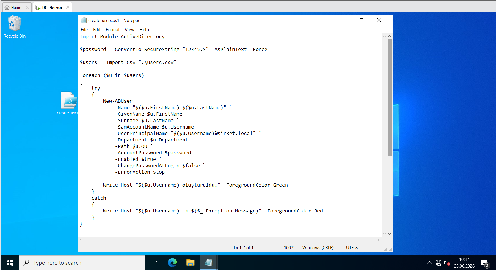
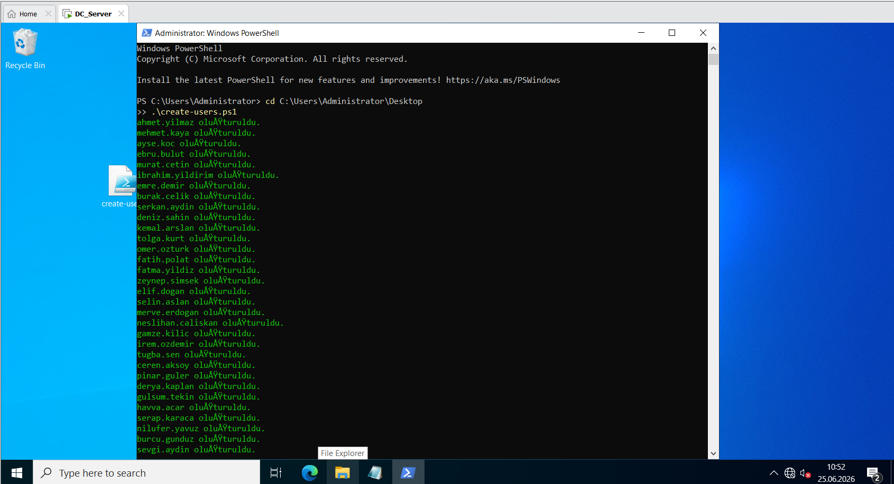
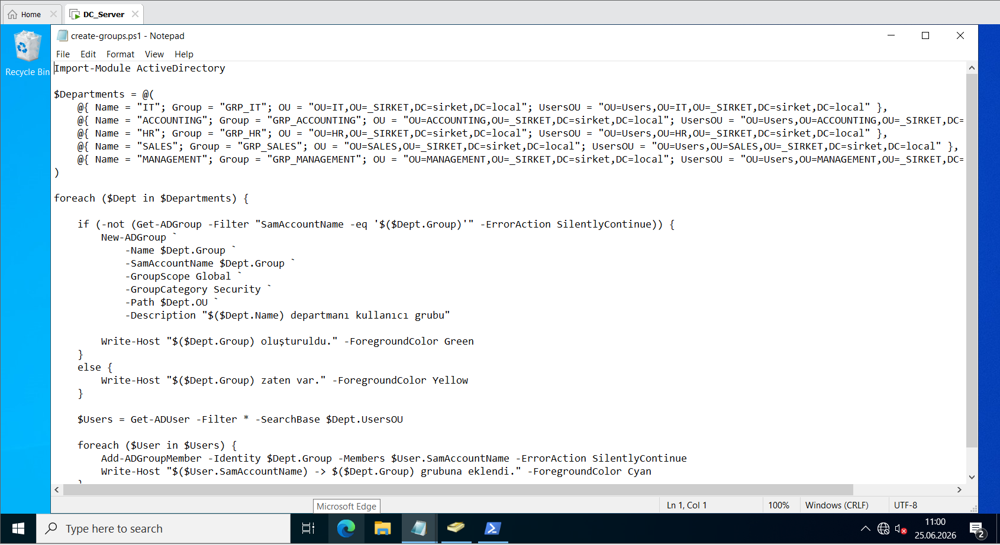
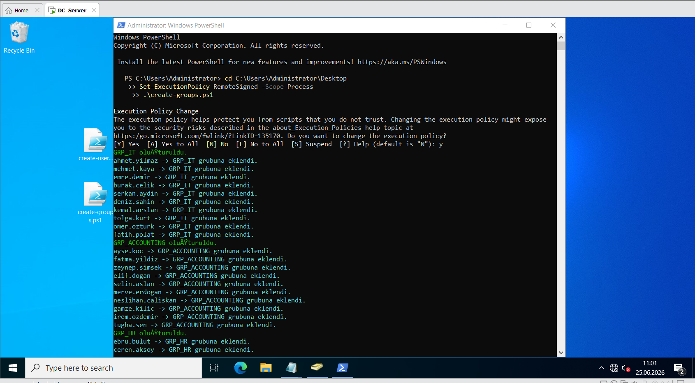
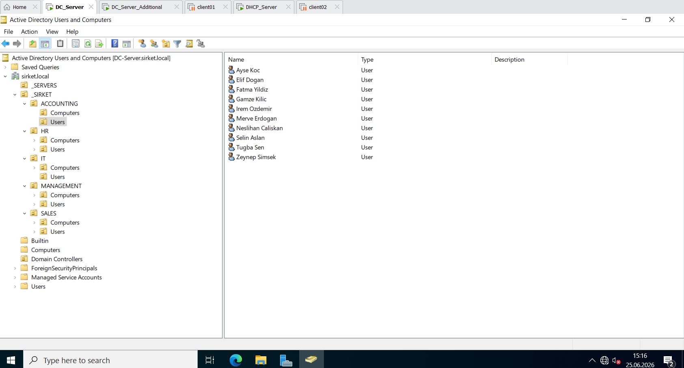
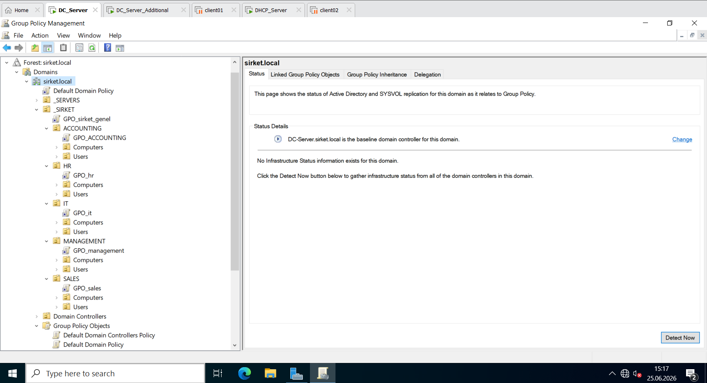
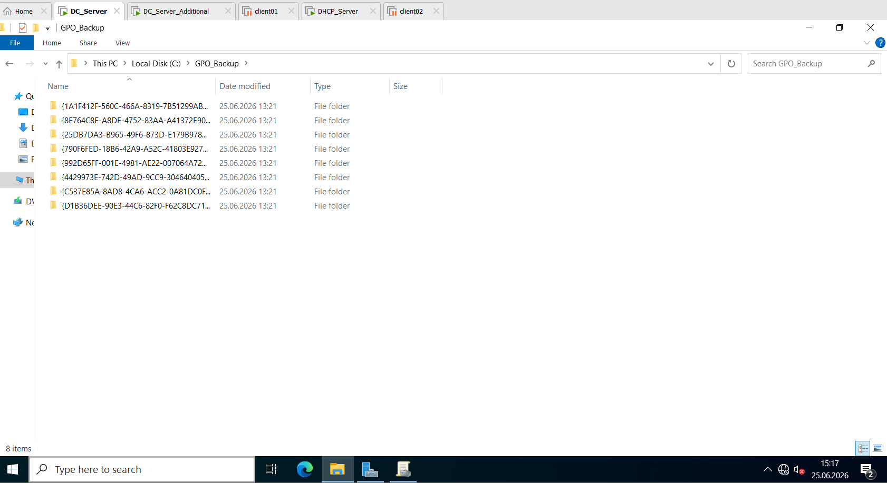

1. Automated User Creation via CSV & PowerShell / CSV ve PowerShell ile Otomatik Kullanıcı Kurulumu

Aşağıdaki görsellerde: Üstte tek satırda kullanıcı bilgilerini hazırladığım CSV dosyası; altta yan yana ise bu kullanıcıları otomatik olarak oluşturan PowerShell script kodlarım ve terminal çıktısı yer almaktadır.
The images below display: On top, the source CSV file containing user metrics; below side-by-side, the PowerShell automation script and successful execution logs.

<table width="100%" style="border-collapse: collapse; border: none;">
  <tr style="border: none;">
    <td colspan="2" style="width: 100%; padding: 4px; border: none;">
      
    </td>
  </tr>
  <tr style="border: none;">
    <td style="width: 50%; padding: 4px; border: none;">
      
    </td>
    <td style="width: 50%; padding: 4px; border: none;">
      
    </td>
  </tr>
</table>

*English:
In an enterprise environment, creating dozens of users manually through the interface is both a major waste of time and invites human error. To simulate real-world production standards and ensure operational efficiency, I automated the provisioning process for 50 corporate users distributed across 5 different departments. First, I prepared a structured CSV file containing corporate information such as Firstname, Lastname, Username, Target OU, and Title. Then, I developed a script in PowerShell. Using this script, I looped through all the rows in the CSV file to configure user logon names in a standardized firstname.lastname format, assigned a secure temporary password (12345.S), enabled the accounts, and automatically routed each employee to their specific department folder in the directory while tracking execution logs via the terminal.

*Türkçe:
Kurumsal bir şirkette onlarca kullanıcıyı arayüzden tek tek elle açmak hem büyük bir zaman kaybıdır hem de insan hatasına davetiye çıkarır. Gerçek saha standartlarını simüle etmek ve operasyonel verimlilik sağlamak amacıyla, 5 farklı departmana dağıtılacak 50 şirket kullanıcısının açılma sürecini otomatikleştirdim.İlk adım olarak kullanıcıların `Ad`, `Soyad`, `Kullanıcı Adı`, `Hedef OU` ve `Unvan` gibi kurumsal bilgilerini içeren düzenli bir CSV dosyası hazırladım. Ardından PowerShell üzerinde bir script yazdım. Bu script sayesinde CSV'deki tüm satırları döngüye alarak, kullanıcı adlarını standart `ad.soyad` formatında yapılandırdım, güvenli bir geçici şifre (`12345.S`) atadım, hesapları aktif ettim ve her personeli dizindeki kendi departman klasörüne otomatik olarak yerleştirerek terminal üzerinden logları takip ettim.

---

2. Security Groups Automation Script / Güvenlik Gruplarının Script ile Oluşturulması

Aşağıdaki görsellerde yan yana eşit bölünmüş olarak: Şirket departman güvenlik gruplarını oluşturan ve kullanıcıları bu gruplara otomatik üye yapan PowerShell script kodlarım ve başarılı terminal onayları yer almaktadır.

The images below display side-by-side: The PowerShell script developed to provision security groups and automate membership additions along with terminal deployment logs.

<table width="100%" style="border-collapse: collapse; border: none;">
  <tr style="border: none;">
    <td style="width: 50%; padding: 4px; border: none;">
      
    </td>
    <td style="width: 50%; padding: 4px; border: none;">
      
    </td>
  </tr>
</table>

*English:
Managing permissions and restrictions individually on a user-by-step basis in Active Directory environments is not sustainable and constitutes a major administrative error. Based on the rule that permissions should always be granted through groups, I designed global security groups specific to each department for the file shares and GPO assignments I will make in the coming days. I wrote a PowerShell script that automatically scans my directory structure. Within the script, I created the global security groups belonging to the departments (GRP_IT, GRP_ACCOUNTING, GRP_HR, GRP_SALES, GRP_MANAGEMENT). Immediately after, I automatically made them members of their respective corporate groups in a single move.

*Türkçe:
Active Directory ortamlarında izinleri ve kısıtlamaları kullanıcı bazlı tek tek yönetmek sürdürülebilir değildir ve büyük bir yönetimsel hatadır. İzinlerin her zaman gruplar üzerinden verilmesi gerektiği kuralına dayanarak, ilerleyen günlerde yapacağım dosya paylaşımları ve GPO atamaları için her departmana özel global güvenlik grupları kurguladım.Dizin yapımı otomatik olarak tarayan bir PowerShell scripti yazdım. Script içerisinde departmanlara ait global güvenlik gruplarını (`GRP_IT`, `GRP_ACCOUNTING`, `GRP_HR`, `GRP_SALES`, `GRP_MANAGEMENT`) oluşturdum. Hemen ardından tek hamlede kendi kurumsal gruplarına otomatik üye yaptım.

---

3. Active Directory OU & Group Architecture / AD OU ve Grup Altyapısının Görünümü

Aşağıdaki görselde, tüm satırı kaplayacak şekilde: Active Directory Users and Computers (ADUC) konsolu üzerinde oluşturduğum kurumsal OU hiyerarşisi, departman kırılımları ve güvenlik grupları yer almaktadır.

The image below displays a full-width viewport of: The Active Directory Users and Computers (ADUC) console showcasing the logical OU hierarchy, department structures, and provisioned group objects.

*English:
An intuitive and organized hierarchy is vital to keep corporate assets structured and to bound target Group Policies precisely. I consolidated all business components under a master OU to separate them from default system folders.
**How:** Within the Active Directory Users and Computers (ADUC) snap-in, I created a root organizational unit named `_SIRKET`. Inside it, I built 5 specific branch OUs for each business vertical: `IT`, `ACCOUNTING`, `HR`, `SALES`, and `MANAGEMENT`. To maintain strict administration boundaries, each department folder was configured with sub-containers named `Users` and `Computers`. This structural layout allows me to cleanly organize my automated personnel accounts and keep domain endpoints fully segmented.

*Türkçe:
Düzenli bir hiyerarşi, kurumsal varlıkların karmakarışık olmasını engellemek ve Group Policy nesnelerini tam hedef kitleye basabilmek için şarttır. Şirket yapısını varsayılan sistem klasörlerinden ayırmak adına tüm departmanları tek bir çatı altında topladım. Active Directory Users and Computers (ADUC) yönetim konsolunu açarak root (kök) dizinde `_SIRKET` adında bir ana OU oluşturdum. Bu yapının altına şirketin iş kollarını temsil eden `IT`, `ACCOUNTING`, `HR`, `SALES` ve `MANAGEMENT` adında 5 adet departman OU'su ekledim. Yönetim sınırlarını tam çizmek adına her departman klasörünün altına da `Users` (Kullanıcılar) ve `Computers` (Bilgisayarlar) alt kırılımlarını yerleştirdim. Bu sayede script ile açtığım kullanıcı hesaplarını ve domaindeki bilgisayarları tamamen birbirinden yalıtılmış ve düzenli bir yapıda topladım.

---

4. Group Policy Management Architecture & Policy Matrix / Group Policy Yönetimi ve Politika Matrisi

Aşağıdaki görselde, tüm satırı kaplayacak şekilde: Group Policy Management Konsolu üzerinde kurguladığım, şirket genelini ve departmanları hedef alan tüm merkezi politika (GPO) listesi yer almaktadır.

The image below displays a full-width viewport of: The Group Policy Management console reflecting the deployment topology and linking structure of all custom organizational policies.

*English:
Centralized endpoint management is a core objective of this infrastructure. Rather than applying generic restrictions to everyone, I designed a multi-layered Group Policy architecture to apply tailored security configurations based on unique department compliance goals.I launched the `Group Policy Management` console and designed separate GPO modules linked directly to their targeted organizational levels:
* **GPO_Sirket_Genel:Linked at the root of `_SIRKET`. It enforces strict baseline account security, including domain-wide corporate password complexity rules, account lockout thresholds (3 failed attempts locks the session for 15 minutes), and an automated interactive logon screen saver lock (10 minutes) to secure unattended hardware.
* **GPO_ACCOUNTING:Linked to the Accounting OU. It enforces extreme internal data security by completely blocking USB mass storage redirection, hiding the Control Panel, and disabling Task Manager to prevent configuration tampering.
* **GPO_HR:Linked to the Human Resources OU. It locks down administrative execution paths by blocking user access to CMD and PowerShell terminal environments, while enforcing a mandatory corporate desktop wallpaper to maintain brand consistency.
* **GPO_SALES:Linked to the Sales OU. It prevents local machine manipulation by blocking access to the Registry Editor (`regedit`) and revoking USB storage read/write permissions to mitigate data exfiltration vectors.
* **GPO_IT:Linked to the IT OU. It maintains administrative flexibility with minimal endpoint software restrictions while granting dedicated Remote Desktop (RDP) rights to all technical engineers for efficient remote management.

*Türkçe:
Merkezi sistem yönetimi ve uç nokta güvenliği bu projenin temel hedeflerinden biridir. Herkese aynı kısıtlamaları vermek yerine, departmanların iş ihtiyaçlarına ve güvenlik risklerine göre özelleştirilmiş, çok katmanlı bir Group Policy (GPO) mimarisi kurguladım. `Group Policy Management` konsolunu açarak, oluşturduğum kurumsal OU yapısına uygun olarak şu politikaları tasarladım ve ilgili yerlere bağladım (linkledim):
* **GPO_Sirket_Genel:`_SIRKET` ana klasörüne bağladım. Tüm şirket çalışanları için geçerli temel güvenlik kurallarını içerir; karmaşık şifre zorunluluğu, hatalı şifre denemesinde hesap kilitleme (3 hatalı denemede 15 dakika kilit) ve bilgisayar başında olunmadığında devreye giren otomatik ekran koruyucu kilidi (10 dakika) gibi temel ayarları bu GPO ile bastım.
* **GPO_ACCOUNTING: Muhasebe departmanına bağladım. Finansal verilerin korunması amacıyla bu kullanıcıların bilgisayarlarında USB harici disk kullanımını tamamen engelledim, sistem ayarlarına müdahale edememeleri için Kontrol Panelini (Denetim Masası) gizledim ve Görev Yöneticisini devre dışı bıraktım.
* **GPO_HR: İnsan Kaynakları departmanına bağladım. Personellerin komut çalıştırmasını önlemek için CMD ve PowerShell terminal erişimlerini engelledim; kurumsal ciddiyet için de masaüstü duvar kağıtlarını şirket logosuyla sabitledim.
* **GPO_SALES:Satış departmanına bağladım. Bilgisayarların işletim sistemi kararlılığını korumak için Kayıt Defteri Düzenleyicisi'ne (`regedit`) erişimi kapattım ve veri sızıntılarını önlemek adına USB depolama birimlerini engelledim.
* **GPO_IT:IT departmanına bağladım. Teknik ekibin operasyonlarını engellememek için istemci bilgisayarlarında kısıtlamaları minimumda tuttum ve tüm IT mühendislerine uzaktan yönetim için Uzak Masaüstü (RDP) erişim yetkileri tanımladım.

---

5. Group Policy Objects Backup & Disaster Recovery / GPO Yedekleme ve Olağanüstü Durum Yönetimi

**English:**
Group Policy configurations represent critical infrastructure intelligence. Any accidental modification, corruption, or catastrophic domain controller failure can compromise entire endpoint security baselines. To adhere to corporate disaster recovery (DR) standards and ensure business continuity, I implemented a strict backup strategy for all custom GPOs. Inside the Group Policy Management Console, I navigated to the "Group Policy Objects" container, right-clicked, and initiated a comprehensive backup execution. I designated a secure, structured local directory to store the metadata, security descriptors, and unique registry settings for each custom policy (`GPO_Sirket_Genel`, `GPO_ACCOUNTING`, etc.). This practice allows me to instantly roll back unauthorized policy changes or restore the entire directory's configuration layout to a healthy state in minutes.

*Türkçe:
Yapılandırılan Group Policy nesneleri, tüm şirket altyapısının güvenlik ve yönetim haritasını barındırır. Politikaların kazara silinmesi, bozulması ya da sistemde oluşabilecek büyük bir sunucu arızası tüm uç nokta güvenliğini tehlikeye atabilir. Bu tarz risklere karşı kurumsal bir felaket kurtarma (Disaster Recovery) önlemi almak ve iş sürekliliğini korumak amacıyla, oluşturduğum tüm özelleştirilmiş GPO'ların yedeğini aldım. Group Policy Management Konsolu üzerinde "Group Policy Objects" klasörüne sağ tıklayarak tüm politikaları kapsayan toplu bir yedekleme (Backup All) işlemi başlattım. Tasarladığım her bir politika nesnesinin (`GPO_Sirket_Genel`, `GPO_ACCOUNTING` vb.) benzersiz ayarlarını, güvenlik tanımlayıcılarını ve kayıt defteri girdilerini güvenli ve düzenli bir klasör dizinine aktardım. Bu işlem sayesinde, gelecekte yapılabilecek hatalı bir politika değişikliğini saniyeler içinde geri alabilecek veya olası bir kriz anında tüm kısıtlamaları sıfırdan sorunsuz şekilde geri yükleyebilecek (Restore) güvenli bir altyapı hazırladım.