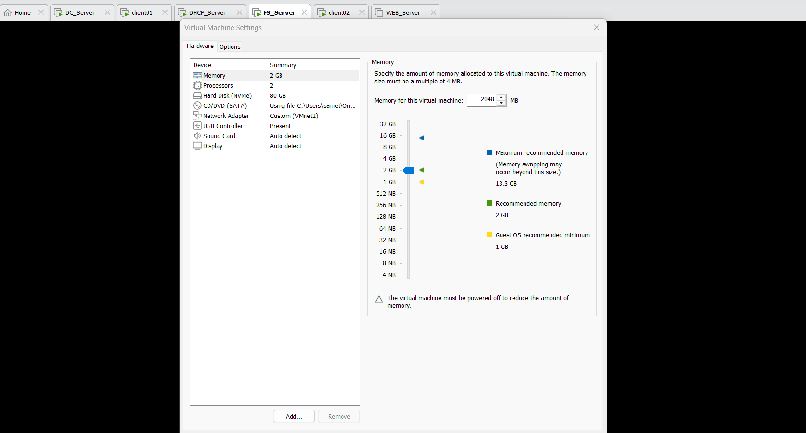
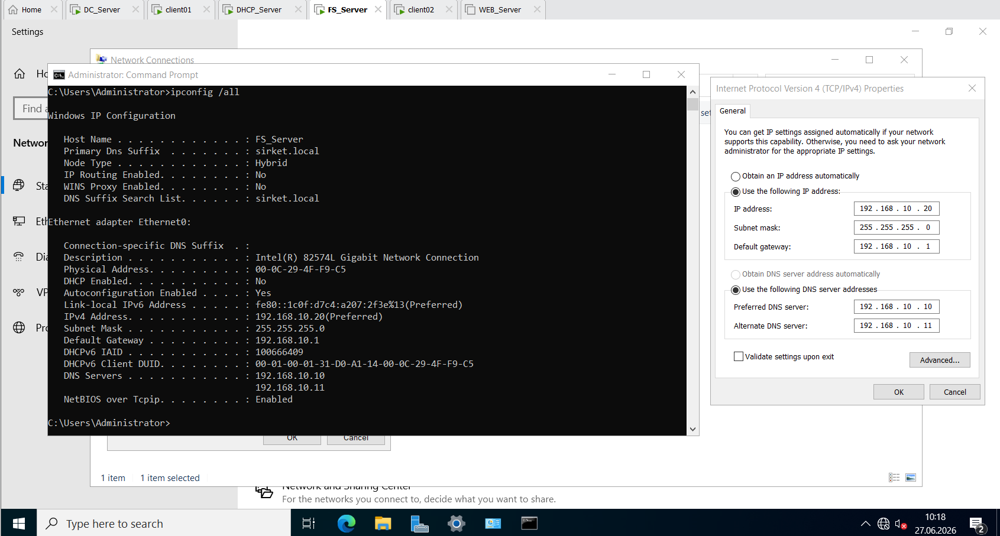
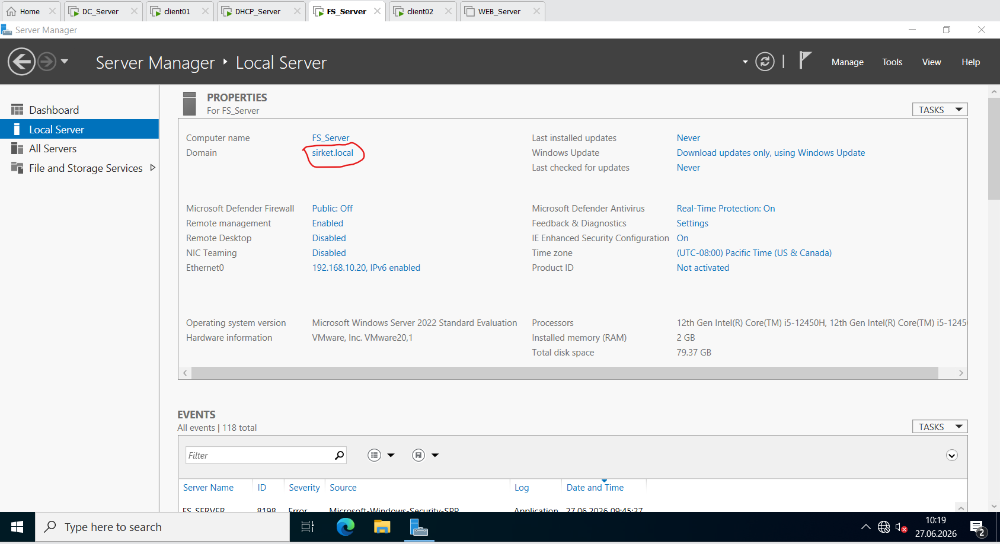
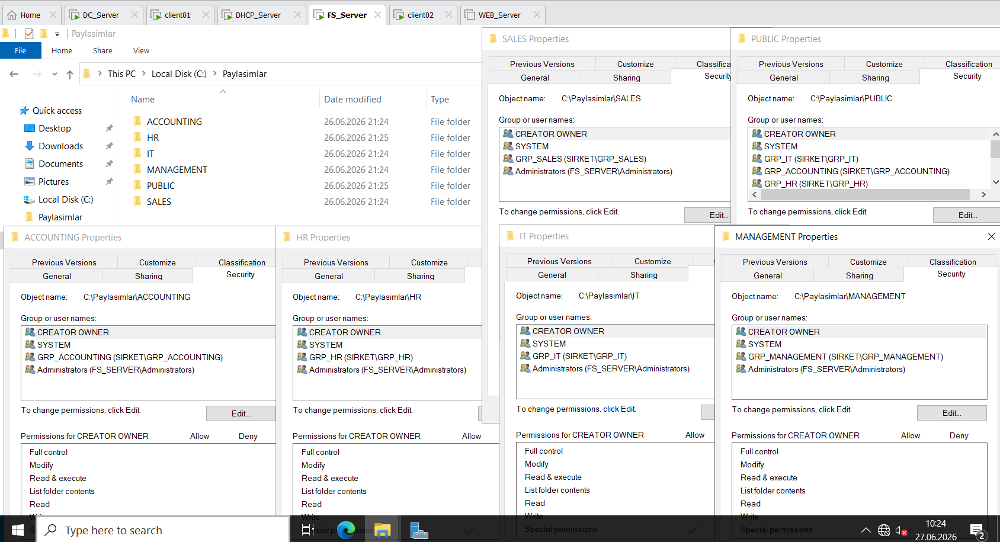
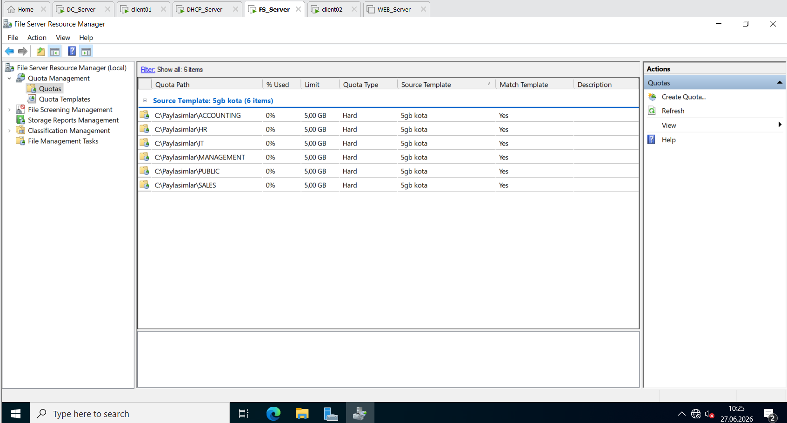
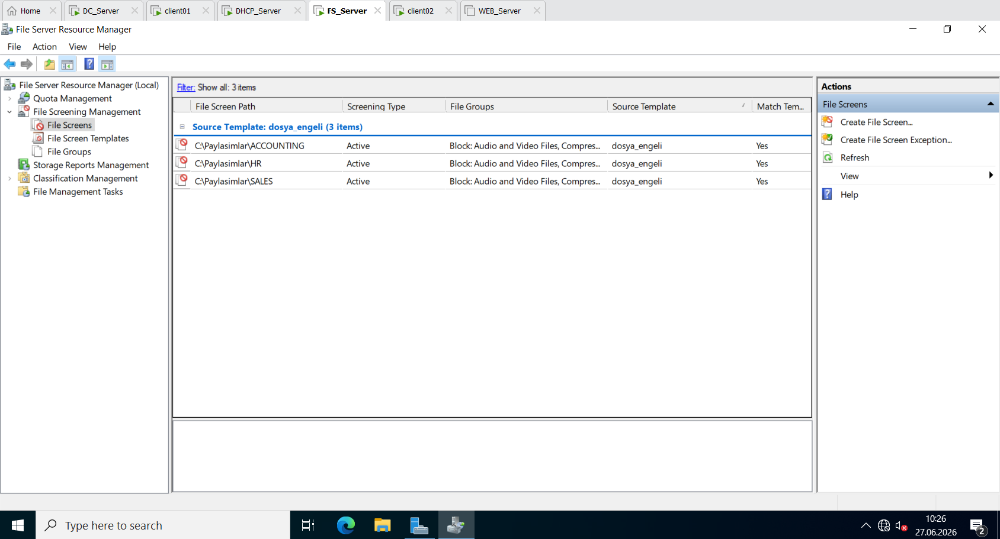
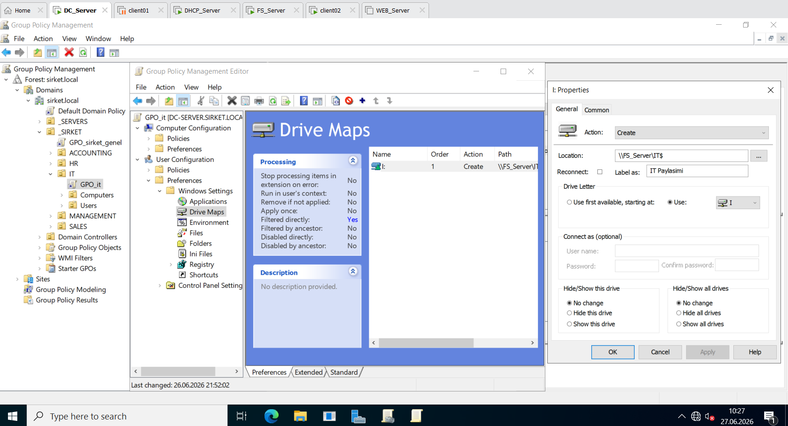
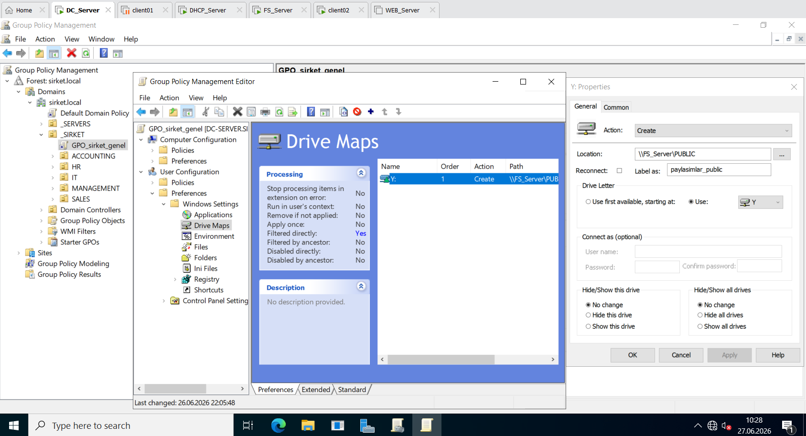
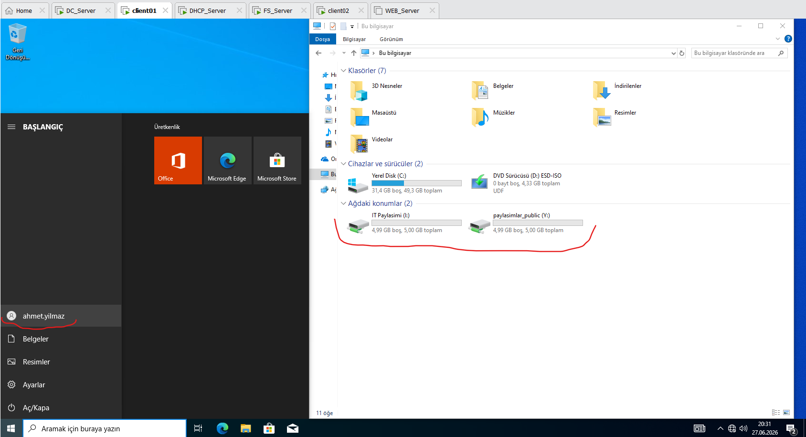
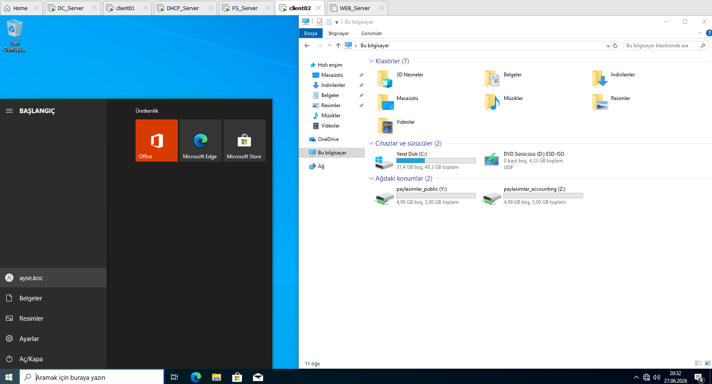

1. File Server Deployment & Baseline Network Parameters / Dosya Sunucusu Kurulumu ve Ağ Yapılandırması

Aşağıdaki görsellerde: Üstte tek satırda FS_Server sanal makinesinin donanım özellikleri; altta yan yana ise statik IP parametreleri ile `sirket.local` etki alanına (domain) katılım sağlandığına dair onay ekranı yer almaktadır.

The images below display: On top, FS_Server VM hardware specifications; below side-by-side, static IP address parameters and verification of successful join to the sirket.local domain.

<table width="100%" style="border-collapse: collapse; border: none;">
  <tr style="border: none;">
    <td colspan="2" style="width: 100%; padding: 4px; border: none;">
      
    </td>
  </tr>
  <tr style="border: none;">
    <td style="width: 50%; padding: 4px; border: none;">
      
    </td>
    <td style="width: 50%; padding: 4px; border: none;">
      
    </td>
  </tr>
</table>

**English:
To ensure strict security boundaries and isolate network roles, I deployed a dedicated instance named `FS_Server` using Windows Server 2022 to handle corporate file storage independently from my Domain Controllers. I allocated 2 GB of RAM, 2 CPU cores, and an expanded 80 GB disk to accommodate the growth of shared directories. I provisioned a persistent static IP address of `192.168.10.20`, pointing its preferred and alternate DNS to `DC_Server` and `DC_Server_Additional` respectively. Finally, I authenticated with administrative credentials and successfully joined the server to the `sirket.local` domain to ensure integrated resource management[cite: 5].

**Türkçe:
Güvenlik sınırlarını korumak ve ağ rollerini birbirinden izole etmek amacıyla, dosya paylaşım servislerini Domain Controller sunucularımdan ayrı tutmak adına Windows Server 2022 tabanlı bağımsız bir `FS_Server` sunucusu kurdum. Bu makineye 2 GB RAM, 2 işlemci çekirdeği ve paylaşım klasörlerinin büyüme payını hesaba katarak 80 GB disk alanı tahsis ettim. Ağ kartına statik olarak `192.168.10.20` IP adresini tanımlarken birincil ve ikincil DNS olarak `DC_Server` ile `DC_Server_Additional` sunucularımı gösterdim. Son adımda yetkili yönetici bilgilerini girerek sunucuyu `sirket.local` domainine dahil ettim ve merkezi yönetim için hazır hale getirdim.

---

2. Shared Directory Hierarchy & Permissions Management / Paylaşım Klasör Yapısı ve Yetkilendirme

Aşağıdaki görselde, tüm satırı kaplayacak şekilde: Dosya sunucusu üzerinde oluşturduğum ana paylaşım dizini ve departmanlara özel hazırlanan alt klasör yapısı yer almaktadır.

The image below displays a full-width viewport of: The root sharing directory and the individual sub-folders created for each target corporate department.

**English:
I organized the enterprise data storage by establishing a root folder at `C:\Paylasimlar` and creating dedicated departmental sub-folders alongside a unified `public` folder for company-wide access. To protect internal data and prevent permission leaks, I disabled inheritance on every single folder, converted inherited permissions into explicit ones, and completely removed the default "Users" security identifier. I structured a two-layer access model based on the principle of least privilege: Share Permissions are left wide open to *Everyone: Full Control*, while precise control is enforced via NTFS Permissions. Under this structure:
* `IT` (Hidden via `IT$` share): Only members of `GRP_IT` have *Modify* privileges.
* `ACCOUNTING` (Hidden via `ACCOUNTING$` share): Only members of `GRP_ACCOUNTING` have *Modify* privileges.
* `HR` (Hidden via `HR$` share): Only members of `GRP_HR` have *Modify* privileges.
* `SALES` (Hidden via `SALES$` share): Only members of `GRP_SALES` have *Modify* privileges.
* `MANAGEMENT` (Hidden via `MANAGEMENT$` share): Only members of `GRP_MANAGEMENT` have *Modify* privileges.
* `PUBLIC`: Open to all `Domain Users` with *Modify* privileges for corporate collaboration.

By appending the `$` symbol to the share names of the department folders, I made them completely hidden from network browsing, requiring an absolute UNC path to achieve access[cite: 5].

**Türkçe:
Kurumsal verileri düzenlemek adına `C:\Paylasimlar` dizini altında bir ana havuz oluşturdum; departmanlara özel alt klasörleri ve herkesin ortak kullanacağı `PUBLIC` klasörünü yapılandırdım. Veri güvenliğini sağlamak ve yetki sızıntılarını önlemek amacıyla tüm klasörlerde kalıtımı (inheritance) devre dışı bırakarak varsayılan "Users" grubunun yetkilerini tamamen temizledim. Güvenlik standartlarına uygun olarak iki katmanlı bir yetki modeli kurguladım: Paylaşım (Share) izinlerinde *Everyone: Full Control* yetkisi vererek yönetimi kolaylaştırırken, asıl kısıtlamayı NTFS izinleri (Security) sekmesinden yaptım. Bu doğrultuda:
* `IT` klasörüne (Ağda `IT$` adıyla gizli): Sadece `GRP_IT` grubu *Modify* (Değiştirme) yetkisiyle erişebilir.
* `ACCOUNTING` klasörüne (Ağda `ACCOUNTING$` adıyla gizli): Sadece `GRP_ACCOUNTING` grubu *Modify* yetkisiyle erişebilir.
* `HR` klasörüne (Ağda `HR$` adıyla gizli): Sadece `GRP_HR` grubu *Modify* yetkisiyle erişebilir.
* `SALES` klasörüne (Ağda `SALES$` adıyla gizli): Sadece `GRP_SALES` grubu *Modify* yetkisiyle erişebilir.
* `MANAGMENT` klasörüne (Ağda `MANAGMENT$` adıyla gizli): Sadece `GRP_MANAGEMENT` grubu *Modify* yetkisiyle erişebilir.
* `PUBLIC` klasörüne: Tüm `Domain Users` (Etki Alanı Kullanıcıları) ortak çalışma için *Modify* yetkisiyle erişebilir.

Departman klasörlerinin paylaşım adlarının sonuna `$` işareti ekleyerek ağ üzerinden tarandıklarında görünmemelerini (Hidden Share) sağladım; böylece erişim sadece tam UNC adresi girilerek mümkün olmaktadır[cite: 5].

---

3. FSRM Quota Management & File Screening Policy / FSRM Kota Yönetimi ve Dosya Filtreleme

Aşağıdaki görsellerde yan yana eşit bölünmüş olarak: Sol tarafta departman klasörlerine uyguladığım 5 GB disk kota sınırları; sağ tarafta ise tehlikeli uzantıların yüklenmesini engelleyen dosya filtreleme kuralları yer almaktadır.

The images below display side-by-side: On the left, the 5 GB hard quota limitations enforced on department folders; on the right, the active file screening policies preventing restricted extensions.

<table width="100%" style="border-collapse: collapse; border: none;">
  <tr style="border: none;">
    <td style="width: 50%; padding: 4px; border: none;">
      
    </td>
    <td style="width: 50%; padding: 4px; border: none;">
      
    </td>
  </tr>
</table>

**English:
To prevent dynamic storage depletion and reinforce proactive server defense, I configured the File Server Resource Manager (FSRM) role. First, I engineered a "Hard Quota" template limiting each department folder strictly to 5 GB, which completely stops write actions when hit and triggers an alert email to the admin when storage utilization crosses 85%. Second, I developed an "Active Screening" file filter policy to completely block users from dropping forbidden groups of files, specifically targeting Audio/Video extensions (`.mp3`, `.mp4`, `.avi`), Executables (`.exe`, `.bat`, `.msi`), and Compressed archives (`.zip`, `.rar`)[cite: 5]. This block is pushed actively to `ACCOUNTING`, `HR`, and `SALES` to secure business data from malware propagation, while `IT` and `MANAGMENT` are left unrestricted to preserve administrative operations[cite: 5].

**Türkçe:
Depolama alanlarının kontrolsüzce doldurulmasını engellemek ve sunucu güvenliğini proaktif hale getirmek amacıyla File Server Resource Manager (FSRM) rolünü yapılandırdım. İlk olarak, her departman klasörünü kesin bir şekilde 5 GB ile sınırlandıran bir "Hard Quota" (Sert Kota) şablonu kurguladım; bu limit aşıldığında yazma eylemi tamamen durmakta ve doluluk %85'e ulaştığında yöneticiye uyarı e-postası gönderilmektedir. İkinci olarak, kullanıcıların paylaşım klasörlerine gereksiz veya tehlikeli dosyalar yüklemesini engellemek için bir "Active Screening" (Aktif Filtreleme) politikası oluşturdum; ses/video (`.mp3`, `.mp4`), çalıştırılabilir dosyalar (`.exe`, `.bat`, `.msi`) ve sıkıştırılmış arşivlerin (`.zip`, `.rar`) yüklenmesini tamamen engelledim. Bu kısıtlamayı zararlı yazılımların yayılmasını önlemek amacıyla `ACCOUNTING`, `HR` ve `SALES` klasörlerine uygularken, operasyonel araçlara ihtiyaç duyan `IT` ve `MANAGMENT` birimlerini muaf tuttum.

---

4. Group Policy Automated Network Drive Mapping / GPO ile Ağ Sürücüsü Eşleştirmesi

Aşağıdaki görsellerde yan yana eşit bölünmüş olarak: Sol tarafta `GRP_IT` grubu için kurguladığım I: sürücüsü drive map politikası; sağ tarafta ise tüm şirkete uygulanan ortak Y: sürücüsü (PUBLIC) drive map politikası yer almaktadır.

The images below display side-by-side: On the left, the driving map policy provisioning the I: drive for `GRP_IT`; on the right, the global corporate Y: drive mapping policy assigned to all authenticated domain users.

<table width="100%" style="border-collapse: collapse; border: none;">
  <tr style="border: none;">
    <td style="width: 50%; padding: 4px; border: none;">
      
    </td>
    <td style="width: 50%; padding: 4px; border: none;">
      
    </td>
  </tr>
</table>

**English:
To streamline access, I used Group Policy to ensure that when any user signs in, their mapped department share and the corporate general share automatically mount as network drives. Due to space and presentation standards, only a few sample deployment screens are displayed here, but I fully implemented this automation for every business unit.the drive mappings under `User Configuration -> Preferences -> Windows Settings -> Drive Maps` across the following policies:
* **GPO_IT: Maps `\\FS_Server\IT$` to the **I:** drive letter, restricted to members of `GRP_IT` via Item-Level Targeting.
* **GPO_ACCOUNTING: Maps `\\FS_Server\ACCOUNTING$` to the **F:** drive letter, target locked to `GRP_ACCOUNTING`.
* **GPO_HR: Maps `\\FS_Server\HR$` to the **H:** drive letter, target locked to `GRP_HR`.
* **GPO_SALES: Maps `\\FS_Server\SALES$` to the **S:** drive letter, target locked to `GRP_SALES`.
* **GPO_MANAGEMENT: Maps `\\FS_Server\MANAGEMENT$` to the **M:** drive letter, target locked to `GRP_MANAGEMENT`.
* **GPO_Sirket_Genel: Maps the unhidden `\\FS_Server\PUBLIC` directly to the **Y:** drive letter for all Authenticated Users across the domain hierarchy.

**Türkçe:
Kullanıcıların paylaşım adreslerini ezbere bilmesine gerek kalmadan klasörlerine erişebilmesi için, etki alanında oturum açtıklarında departman klasörlerinin ve ortak alanın otomatik birer sürücü harfiyle bağlanmasını sağladım. Görsel düzeni korumak amacıyla ekranda sadece örnek teşkil eden birkaç drive map ayarını gösterdim, fakat bu otomasyonu tüm departmanlar için eksiksiz olarak tamamladım. Domain Controller üzerinde `User Configuration -> Preferences -> Windows Settings -> Drive Maps` adımlarını takip ederek şu politikaları kurguladım:
* **GPO_IT: `\\FS_Server\IT$` adresini **I:** sürücüsü olarak eşleştirir; Item-Level Targeting yardımıyla sadece `GRP_IT` üyelerine bağlanır.
* **GPO_ACCOUNTING: `\\FS_Server\ACCOUNTING$` adresini **F:** sürücüsü olarak eşleştirir; sadece `GRP_ACCOUNTING` üyelerini hedefler.
* **GPO_HR: `\\FS_Server\HR$` adresini **H:** sürücüsü olarak eşleştirir; sadece `GRP_HR` üyelerini hedefler.
* **GPO_SALES: `\\FS_Server\SALES$` adresini **S:** sürücüsü olarak eşleştirir; sadece `GRP_SALES` üyelerini hedefler.
* **GPO_MANAGEMENT: `\\FS_Server\MANAGEMENT$` adresini **M:** sürücüsü olarak eşleştirir; sadece `GRP_MANAGEMENT` üyelerini hedefler.
* **GPO_Sirket_Genel: Gizli olmayan ortak `\\FS_Server\PUBLIC` klasörünü etki alanındaki tüm onaylanmış kullanıcılar için doğrudan **Y:** sürücüsü olarak bağlar.

---

5. Client-Side Drive Mapping Verification & Access Isolation / İstemci Tarafı Doğrulama ve İzolasyon Testleri

Aşağıdaki görsellerde yan yana eşit bölünmüş olarak: Sol tarafta IT personeli `ahmet.yilmaz` kullanıcısının ekranında başarıyla eşleşen I: ve Y: sürücüleri; sağ tarafta ise Muhasebe personeli `ayse.koc` kullanıcısının ekranındaki Z: ve Y: sürücülerinin görünümü yer almaktadır.

The images below display side-by-side: On the left, the client desktop of IT staff `ahmet.yilmaz` showing only the I: and Y: drives; on the right, the client desktop of accounting staff `ayse.koc` showcasing only the Z: and Y: drives.

<table width="100%" style="border-collapse: collapse; border: none;">
  <tr style="border: none;">
    <td style="width: 50%; padding: 4px; border: none;">
      
    </td>
    <td style="width: 50%; padding: 4px; border: none;">
      
    </td>
  </tr>
</table>

**English:
To validate the integrity of my access lists and drive mapping automation, I conducted verification reviews across client systems. The results perfectly aligned with the security design: every domain employee can strictly view and modify their own department share alongside the global `PUBLIC` share. Although the screenshot highlights only two target profiles for demonstration purposes, all other business groups are identically bound to their respective shares without overlap. When IT engineer `ahmet.yilmaz` logs in, his environment populates **I:** (IT) and **Y:** (PUNLIC), leaving the accounting share completely invisible. Conversely, when accountant `ayse.koc` gains access, her endpoint mounts **Z:** (ACCOUNTING) and **Y:** (PUBLIC), providing a secure, automated, and tightly restricted storage environment.

**Türkçe:
Kurguladığım erişim listelerinin ve ağ sürücüsü otomasyonunun doğruluğunu denetlemek adına istemci bilgisayarlarında testler yürüttüm. Alınan sonuçlar tasarladığım güvenlik modeliyle tam uyum gösterdi: etki alanındaki her çalışan sadece kendi departmanına ait ağ sürücüsünü ve ortak `PUBLIC` havuzu görebilmektedir. Görsellerde karmaşayı önlemek adına yalnızca iki adet kullanıcı profilini örnek olarak gösterdim, fakat diğer tüm iş birimleri de birbirlerinin alanlarını asla göremeyecek şekilde kendi klasörleriyle sınırlandırılmıştır,. IT personeli `ahmet.yilmaz` oturum açtığında ekranda yalnızca **I:** (IT) ve **Y:** (PUBLIC) sürücüleri belirir, ACCOUNTING sürücüsü ise tamamen gizlidir. Aynı şekilde, muhasebe personeli `ayse.koc` giriş yaptığında bilgisayarına sadece **Z:** (Muhasebe) ve **Y:** (Genel) sürücüleri otomatik olarak bağlanır; böylece yetkisiz erişimler merkezi politikalardan tamamen engellenmiş olur.