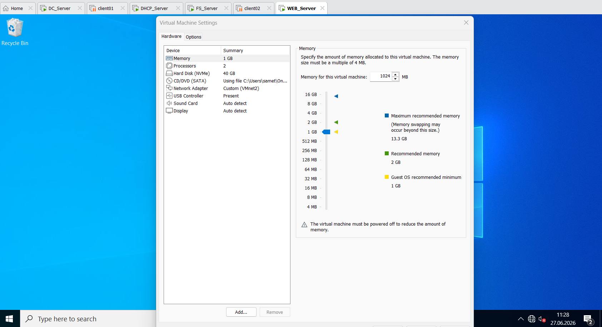
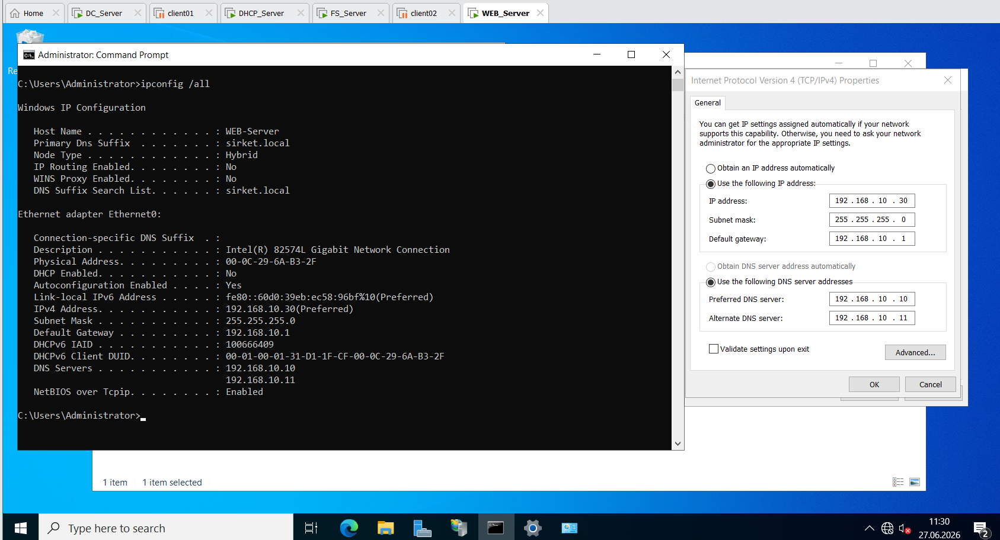
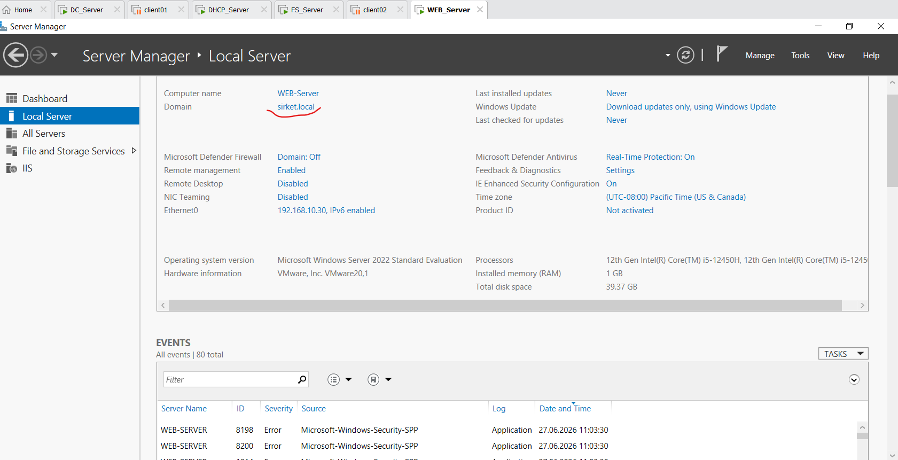
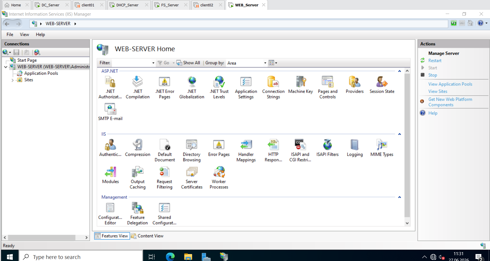
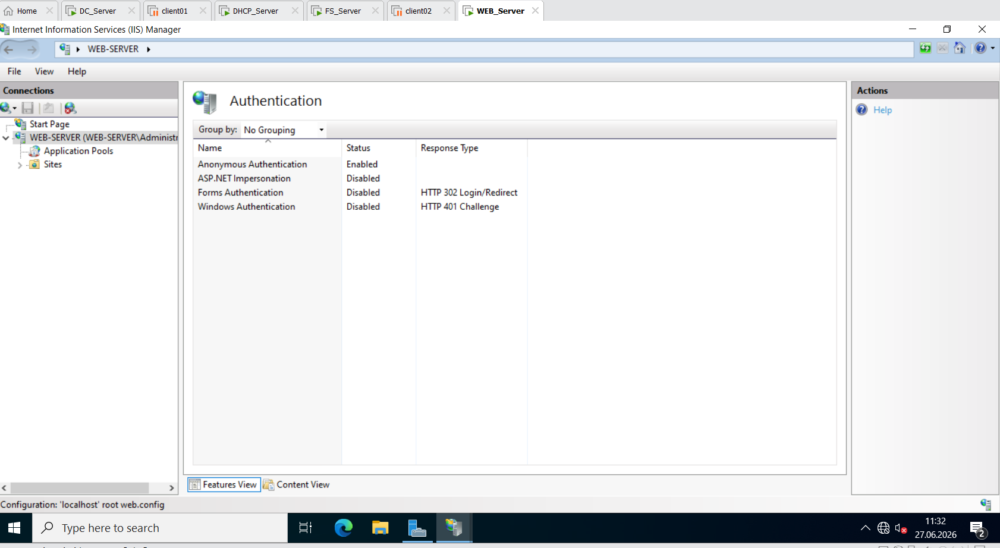
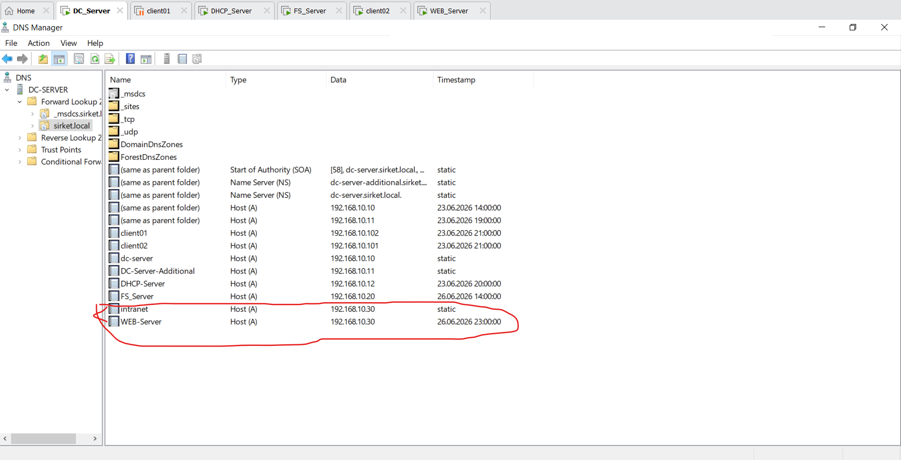
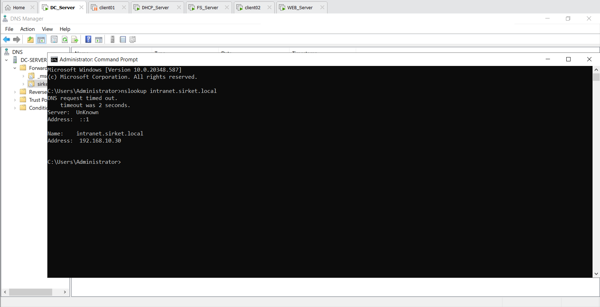
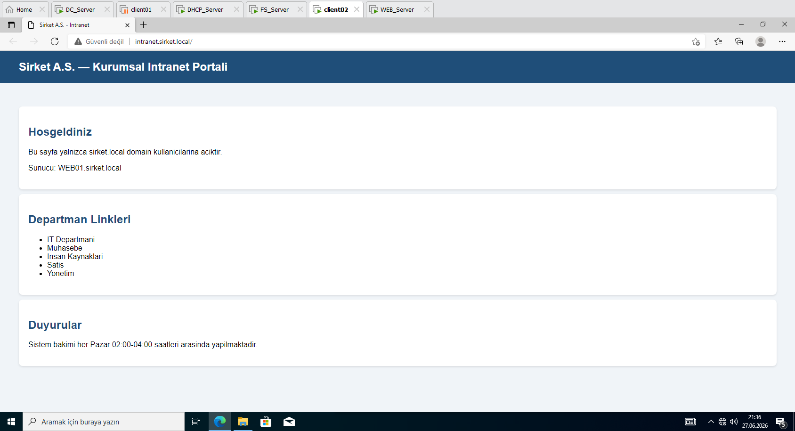

1\. Web Server Deployment \& Baseline Network Parameters / Web Sunucusu Kurulumu ve Ağ Yapılandırması

Aşağıdaki görsellerde: Üstte tek satırda WEB\_Server sanal makinesinin donanım özellikleri; altta yan yana ise statik IP parametreleri ile sirket.local etki alanına (domain) katılım sağlandığına dair onay ekranı yer almaktadır.

The images below display: On top, WEB\_Server VM hardware specifications; below side-by-side, static IP address parameters and verification of successful join to the sirket.local domain.

<table width="100%" style="border-collapse: collapse; border: none;">

&#x20; <tr style="border: none;">

&#x20;   <td colspan="2" style="width: 100%; padding: 4px; border: none;">

&#x20;     

&#x20;   </td>

&#x20; </tr>

&#x20; <tr style="border: none;">

&#x20;   <td style="width: 50%; padding: 4px; border: none;">

&#x20;     

&#x20;   </td>

&#x20;   <td style="width: 50%; padding: 4px; border: none;">

&#x20;     

&#x20;   </td>

&#x20; </tr>

</table>

\*\*English:

To separate web services from directory controllers and maintain enterprise security, I deployed a dedicated web server instance named `WEB\_Server` using Windows Server 2022. I allocated 1 GB of RAM and 40 GB of storage space, which is perfectly optimized for a corporate intranet hosting role. I bound a persistent static IP address of `192.168.10.30` to the network adapter and pointed the Preferred DNS to `DC\_Server` and Alternate DNS to `DC\_Server\_Additional`. Finally, I authenticated with the domain administrator credentials and successfully joined `WEB\_Server` to the `sirket.local` active directory environment.

\*\*Türkçe:

Web servislerini dizin sunucularımdan ayrı tutmak ve kurumsal güvenlik standartlarını korumak amacıyla, Windows Server 2022 işletim sistemiyle çalışan `WEB\_Server` adında bağımsız bir web sunucusu kurdum. Bu sunucuya, kurumsal intranet sayfasını barındırma rolü için kaynaklarımı optimize ederek 1 GB RAM ve 40 GB depolama alanı ayırdım. Ağ kartına statik olarak `192.168.10.30` IP adresini tanımladım, birincil DNS olarak `DC\_Server` ve ikincil DNS olarak `DC\_Server\_Additional` sunucularımı gösterdim. Son işlem olarak domain yetkili bilgilerini girerek sunucumu `sirket.local` etki alanına başarıyla dahil ettim.

\---

2\. Internet Information Services (IIS) Role Installation / IIS Rolünün Kurulması

Aşağıdaki görselde, tüm satırı kaplayacak şekilde: Server Manager üzerinden web sunucusu için kurduğum Internet Information Services (IIS) rolü ve ek alt bileşenleri yer almaktadır.

The image below displays a full-width viewport of: The Internet Information Services (IIS) role and additional sub-features installed via Server Manager.

\*\*English:

I launched the Add Roles and Features Wizard on `WEB\_Server` and installed the Internet Information Services (IIS) Web Server role. During the component selection phase, I included ASP.NET 4.8 and critical HTTP development tools. Most importantly, I expanded the Security configurations and explicitly included the Windows Authentication role service. This granular installation approach allows me to enforce domain-linked authorization filters directly at the web platform level.

\*\*Türkçe:

`WEB\_Server` sunucusu üzerinde Server Manager paneli aracılığıyla Add Roles and Features sihirbazını başlattım ve Internet Information Services (IIS) Web Server rolünü kurdum. Bileşen seçimi aşamasında, kurumsal web servislerinin ihtiyaç duyabileceği ASP.NET 4.8 ve gerekli HTTP geliştirme araçlarını listeye ekledim. En önemlisi, Security (Güvenlik) sekmesini genişleterek Windows Authentication rol hizmetini sisteme dahil ettim. Bu sayede web platformu seviyesinde domain tabanlı yetkilendirme filtreleri uygulayabileceğim bir altyapı hazırladım.

\---

3\. IIS Authentication Configuration / IIS Kimlik Doğrulama Yapılandırması

Aşağıdaki görselde, tüm satırı kaplayacak şekilde: Şirket intranet web sitesi için IIS konsolu üzerinden yaptığım kimlik doğrulama ayarları yer almaktadır.

The image below displays a full-width viewport of: The authentication settings configured via the IIS Manager console for the corporate intranet website.

\*\*English:

To protect internal enterprise web pages from unauthenticated public access, I configured the security bindings inside IIS Manager. I completely disabled Anonymous Authentication for the target website to prevent guest users from viewing corporate material. Simultaneously, I enabled Windows Authentication, ensuring that only authenticated active directory users belonging to the `sirket.local` domain are granted legitimate access to the internal network platform.

\*\*Türkçe:

Şirket içi hassas web sayfalarını yetkisiz dış erişimlerden korumak amacıyla IIS Manager konsolunu açarak güvenlik ayarlarını yapılandırdım. Misafir veya tanınmayan kullanıcıların kurumsal içerikleri görüntülemesini engellemek için Anonymous Authentication (Anonim Kimlik Doğrulama) özelliğini tamamen kapattım. Bunun yerine, sisteme dahil ettiğim Windows Authentication hizmetini aktif hale getirerek web sitesine yalnızca `sirket.local` domainine kayıtlı ve doğrulanmış şirket personelinin erişebilmesini sağladım.

\---

4\. DNS Resource Record Creation \& Resolution Verification / DNS Kayıt Oluşturma ve Çözümleme Doğrulama

Aşağıdaki görsellerde yan yana eşit bölünmüş olarak: Sol tarafta DNS Manager üzerinde oluşturduğum intranet kaydı; sağ tarafta ise istemci bilgisayardaki komut satırında nslookup ile yaptığım başarılı ad çözümleme testi yer almaktadır.

The images below display side-by-side: On the left, the internal host record provisioned within DNS Manager; on the right, the successful name resolution test verified via the nslookup utility on a client endpoint.

<table width="100%" style="border-collapse: collapse; border: none;">

&#x20; <tr style="border: none;">

&#x20;   <td style="width: 50%; padding: 4px; border: none;">

&#x20;     

&#x20;   </td>

&#x20;   <td style="width: 50%; padding: 4px; border: none;">

&#x20;     

&#x20;   </td>

&#x20; </tr>

</table>

\*\*English:

To provide an intuitive web URL instead of forcing employees to type raw IP addresses, I connected to `DC\_Server` and launched the DNS Manager. Inside the `sirket.local` forward lookup zone, I created a new Host (A) record named `intranet`, binding it directly to the web server IP address `192.168.10.30`. To verify the replication and health of this record, I opened the command prompt on a client machine and executed the `nslookup intranet.sirket.local` command. The terminal successfully resolved the custom namespace back to the static IP address of `WEB01`, confirming proper network routing.

\*\*Türkçe:

Çalışanların web sitesine erişirken ham IP adresleri yazmak yerine akılda kalıcı bir adres kullanabilmesi için `DC\_Server` sunucumda DNS Manager konsolunu açtım. `sirket.local` forward lookup zone (ileri arama alanı) altında `intranet` adıyla yeni bir Host (A) kaydı oluşturdum ve bu kaydı web sunucumun IP adresi olan `192.168.10.30` ile eşleştirdim. Oluşturduğum bu kaydın doğruluğunu ve ağda yayılıp yayılmadığını denetlemek amacıyla istemci bilgisayarda komut satırını açarak `nslookup intranet.sirket.local` komutunu çalıştırdım. Komut satırı, bu adresi başarıyla `WEB\_Server` sunucumun statik IP adresine yönlendirdi ve ağ yönlendirmesinin sorunsuz çalıştığını doğruladı.

\---

5\. Browser-Side Intranet Portal Access Verification / Tarayıcı Üzerinden Intranet Portal Erişim Testi

Aşağıdaki görselde, tüm satırı kaplayacak şekilde: Domain üyesi bir istemci bilgisayarda tarayıcı üzerinden açtığım kurumsal intranet ana sayfası yer almaktadır.

The image below displays a full-width viewport of: The corporate intranet main page successfully accessed via a web browser on a domain-joined client endpoint.

\*\*English:

I performed a complete functional verification test on a corporate endpoint machine by launching the web browser and navigating to `http://intranet.sirket.local`. Due to the active Windows Authentication settings, the browser transparently verified the current domain session token and loaded my custom-designed HTML portal page immediately. The portal layout launched correctly, displaying stylized sections and targeted quick links mapped to individual departments like IT, HR, Sales, and Accounting, proving that the web infrastructure is secure and fully operational.

\*\*Türkçe:

Etki alanına dahil edilmiş bir istemci bilgisayarda tarayıcıyı açıp `http://intranet.sirket.local` adresine giderek uçtan uca bir fonksiyonel test gerçekleştirdim. Aktif hale getirdiğim Windows Authentication ayarları sayesinde, sistem arka planda oturum açmış kullanıcının domain kimliğini otomatik olarak doğruladı ve tasarladığım kurumsal HTML portal sayfasını ekrana getirdi. Web sitesi; IT, HR, Satış ve Accountingd epartmanlarına özel yönlendirme bağlantılarını ve kurumsal tasarımı eksiksiz bir şekilde yansıtarak web altyapısının güvenli ve tam çalışır durumda olduğunu kanıtladı.

