1. Mail Server Deployment & DNS Record Management / E-Posta Sunucu Kurulumu ve DNS Kayıt Yönetimi

Aşağıdaki görsellerde: Üstte yan yana eşit bölünmüş olarak MAIL_Server sanal makinesinin donanım özellikleri ile statik IP adresi yapılandırması; altta yan yana eşit bölünmüş olarak ise sunucunun sirket.local etki alanına (domain) katılım sağlandığına dair onay ekranı ve DNS Manager üzerindeki A ile MX kayıtları yer almaktadır.

The images below display: On top side-by-side, MAIL_Server VM hardware specifications and static IP address parameters; below side-by-side, verification of successful domain join and the corresponding A and MX resource records within DNS Manager.

<table width="100%" style="border-collapse: collapse; border: none;">
  <tr style="border: none;">
    <td style="width: 50%; padding: 4px; border: none;">
      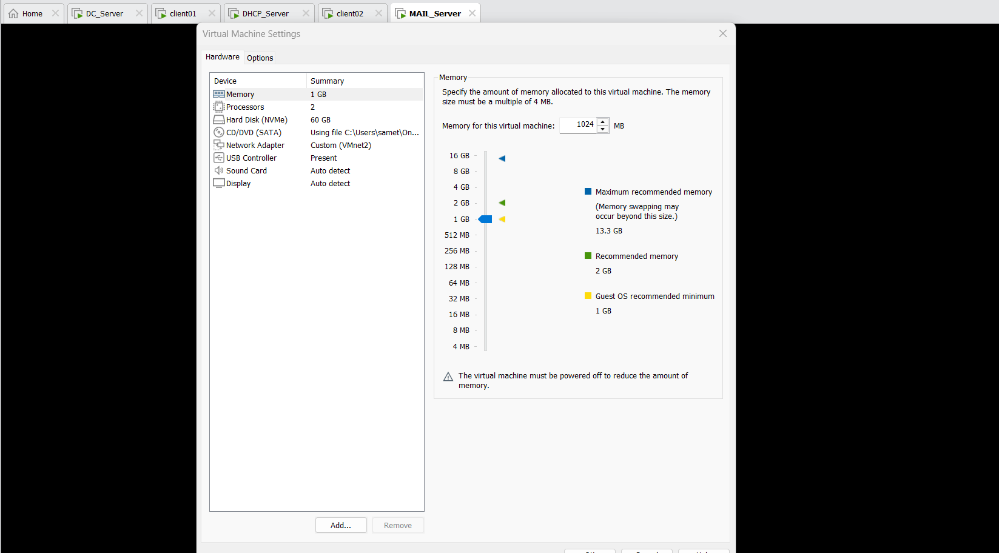
    </td>
    <td style="width: 50%; padding: 4px; border: none;">
      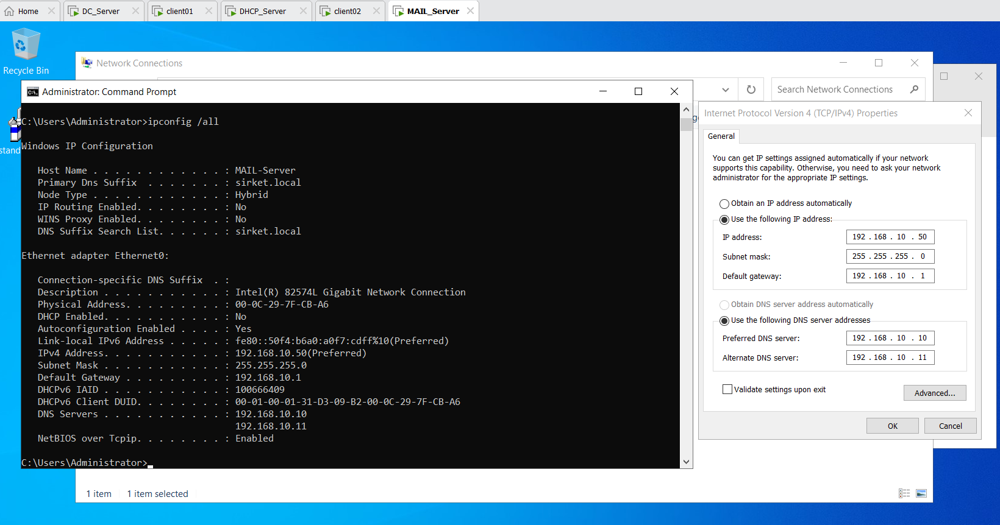
    </td>
  </tr>
  <tr style="border: none;">
    <td style="width: 50%; padding: 4px; border: none;">
      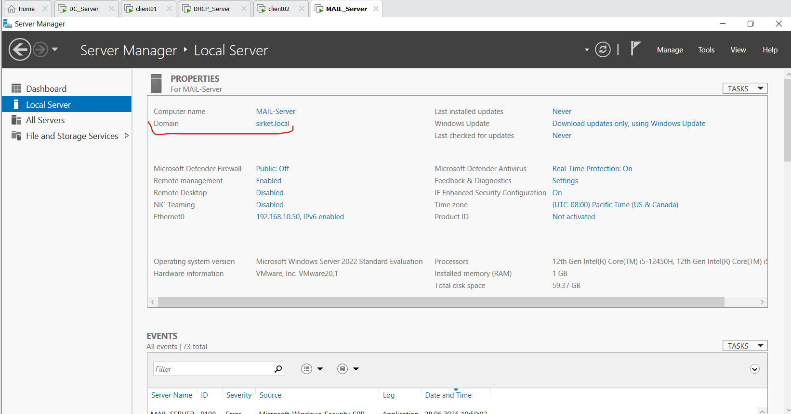
    </td>
    <td style="width: 50%; padding: 4px; border: none;">
      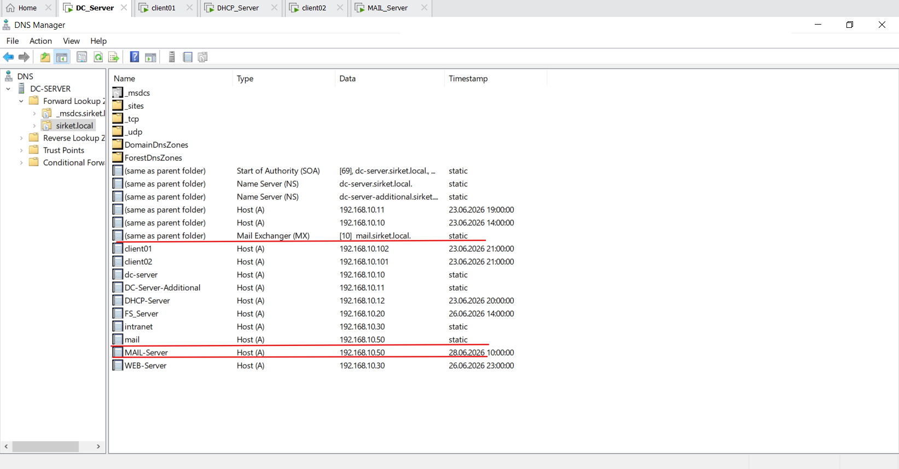
    </td>
  </tr>
</table>

**English:
To simulate corporate communication environments and handle dynamic notifications, I deployed a dedicated mail server named `MAIL_Server` using Windows Server 2022. I optimized the server's resource layout by allocating 1 GB of RAM and 60 GB of disk space. I assigned a static IP address of `192.168.10.50` and linked its preferred DNS to `DC_Server` before successfully joining it to the `sirket.local` domain. To make email delivery functional, I accessed DNS Manager on `DC_Server` and added a Host (A) record pointing `mail.sirket.local` to the server's IP. I also configured a Mail Exchanger (MX) record for the domain with a priority value of 10, ensuring all messaging traffic successfully forwards to my mail sunucu.

**Türkçe:
Kurumsal iletişim ortamlarını simüle etmek ve sistem içi dinamik bildirimleri yönetebilmek amacıyla, Windows Server 2022 üzerinde çalışan `MAIL_Server` adında bağımsız bir e-posta sunucusu kurdum. Sunucu kaynaklarını optimize tutarak sisteme 1 GB RAM ve 60 GB disk alanı tahsis ettim. Ağ kartına statik olarak `192.168.10.50` IP adresini tanımladım, birincil DNS olarak `DC_Server` gösterdim ve ardından sunucuyu `sirket.local` domainine dahil ettim. E-posta trafiğinin çalışabilmesi için `DC_Server` sunucumda DNS Manager'ı açarak `mail.sirket.local` adresini sunucu IP'sine yönlendiren bir Host (A) kaydı ekledim. Ayrıca etki alanı genelinde e-postaların doğru adrese teslim edilmesi için öncelik değeri 10 olan bir Mail Exchanger (MX) kaydı oluşturarak e-posta trafiğini sunucuma bağladım.

---

2. MailEnable Administration Console & Protocol Architecture / MailEnable Yönetim Konsolu ve Protokol Ayarları

Aşağıdaki görsellerde: Üstte yan yana eşit bölünmüş olarak MailEnable Administration Console ana yönetim ekranı ile her departman için açtığım e-posta hesaplarını barındıran Mailboxes sayfası; altta yan yana eşit bölünmüş olarak ise mail istemcilerinin iletişim kurabilmesi için kurguladığım SMTP ve IMAP protokol servis ayarları yer almaktadır.

The images below display: On top side-by-side, the MailEnable Administration Console main dashboard and the Mailboxes workspace featuring custom accounts; below side-by-side, the active SMTP and IMAP network protocol configuration interfaces.

<table width="100%" style="border-collapse: collapse; border: none;">
  <tr style="border: none;">
    <td style="width: 50%; padding: 4px; border: none;">
      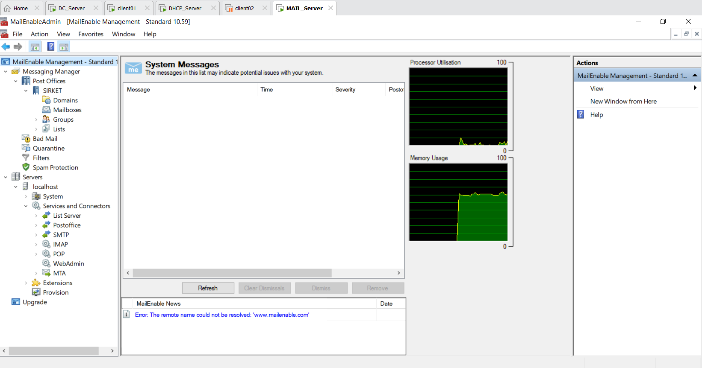
    </td>
    <td style="width: 50%; padding: 4px; border: none;">
      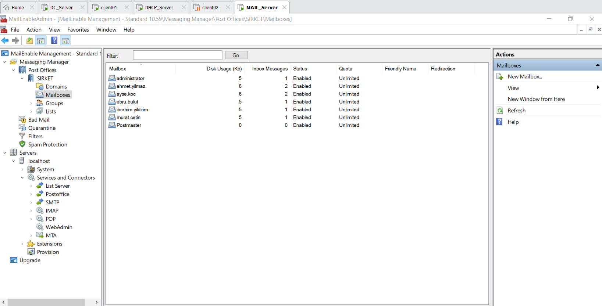
    </td>
  </tr>
  <tr style="border: none;">
    <td style="width: 50%; padding: 4px; border: none;">
      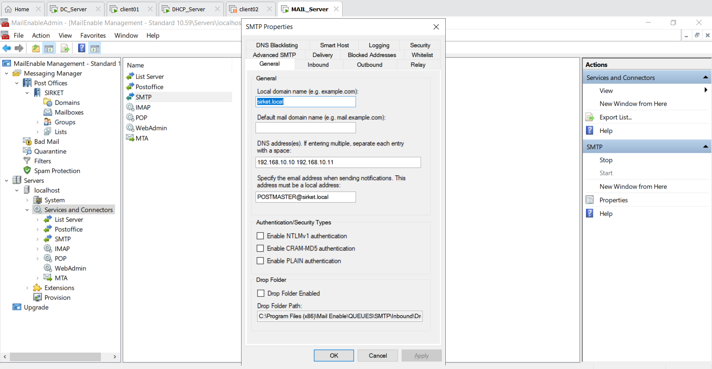
    </td>
    <td style="width: 50%; padding: 4px; border: none;">
      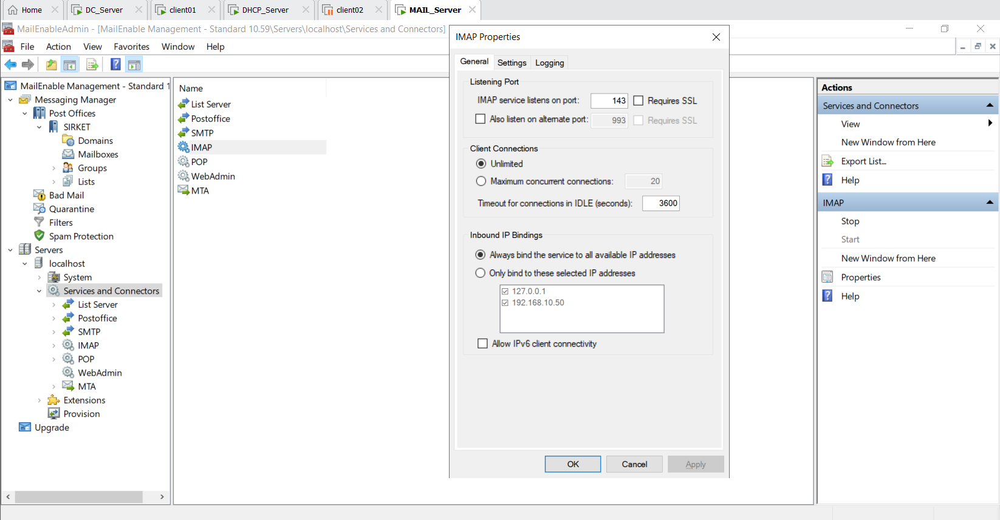
    </td>
  </tr>
</table>

**English:
I installed MailEnable Standard Edition and executed the baseline platform setup. Inside the Administration Console, I configured `sirket.local` as the primary messaging domain and established the `SIRKET` post office container. To test mail flows and verify department isolation, I created a dedicated mailbox for one test user from each organizational department, including `ahmet.yilmaz` (IT), `ayse.koc` (Accounting), alongside `administrator` accounts. To support modern client connectivity, I customized the connector endpoints within the console: I bound the SMTP service to port 25 for server delivery and configured port 587 for client submissions, while activating the IMAP service on port 143 to keep messaging stores synchronized cleanly.

**Türkçe:
Sunucu üzerinde MailEnable Standard Edition kurulumunu tamamlayarak temel yönetim ayarlarını yapılandırdım. Administration Console paneli üzerinde `sirket.local` adresini ana mesajlaşma alanı olarak tanımlayarak `SIRKET` posta ofisi (post office) yapısını kurguladım. E-posta akışlarını test etmek ve departmanlar arası iletişimi doğrulamak amacıyla Mailboxes sekmesinde her iş kolundan birer adet test kullanıcısı için posta kutusu açtım; bu doğrultuda `ahmet.yilmaz` (IT), `ayse.koc` (Accounting) ve `administrator` hesaplarını tanımladım. İstemci bağlantılarını sağlamak adına servis ayarlarını özelleştirdim: e-posta gönderimi için SMTP servisini port 25 ve giden mailler için port 587 üzerinde aktif hale getirirken, maillerin sunucuda senkronize tutulması için IMAP servisini port 143 üzerinde dinlemeye aldım.

---

3. Mail Client Verification & Mail Flow Testing / Thunderbird İstemci ve E-Posta Akış Testleri

Aşağıdaki görsellerde: Üstte yan yana eşit bölünmüş olarak IT personeli Ahmet Yılmaz'ın Thunderbird ana ekranı ile Muhasebe departmanındaki Ayşe Koç'a gönderdiği e-posta; altta yan yana eşit bölünmüş olarak ise Muhasebe personeli Ayşe Koç'un Thunderbird ana ekranı ile Ahmet Yılmaz'dan gelen e-postanın gelen kutusundaki (Inbox) görüntüsü yer almaktadır.

The images below display: On top side-by-side, the Thunderbird interface of IT staff Ahmet Yilmaz and the custom email dispatched to Ayse Koc; below side-by-side, the Thunderbird interface of accounting staff Ayse Koc and the incoming email message sitting inside her mailbox inbox.

<table width="100%" style="border-collapse: collapse; border: none;">
  <tr style="border: none;">
    <td style="width: 50%; padding: 4px; border: none;">
      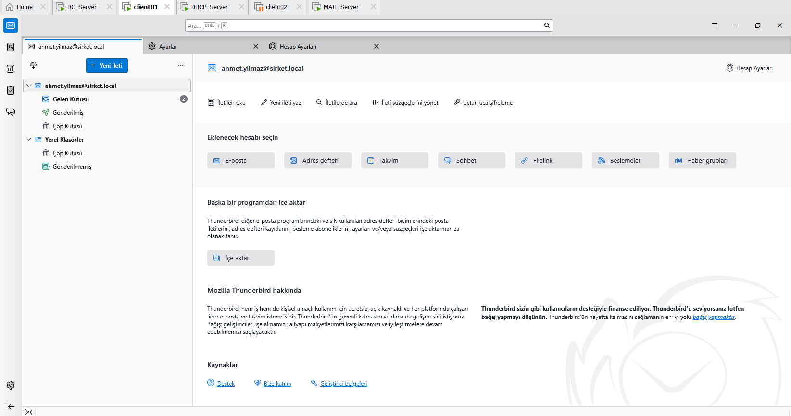
    </td>
    <td style="width: 50%; padding: 4px; border: none;">
      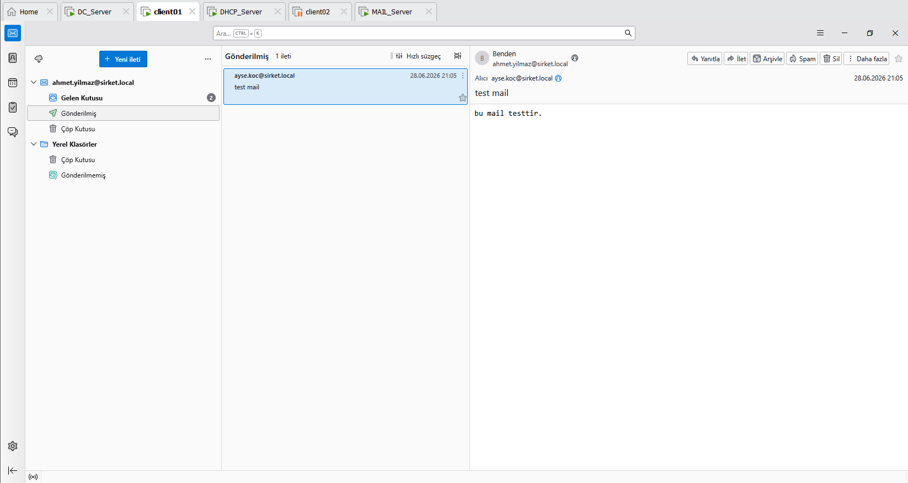
    </td>
  </tr>
  <tr style="border: none;">
    <td style="width: 50%; padding: 4px; border: none;">
      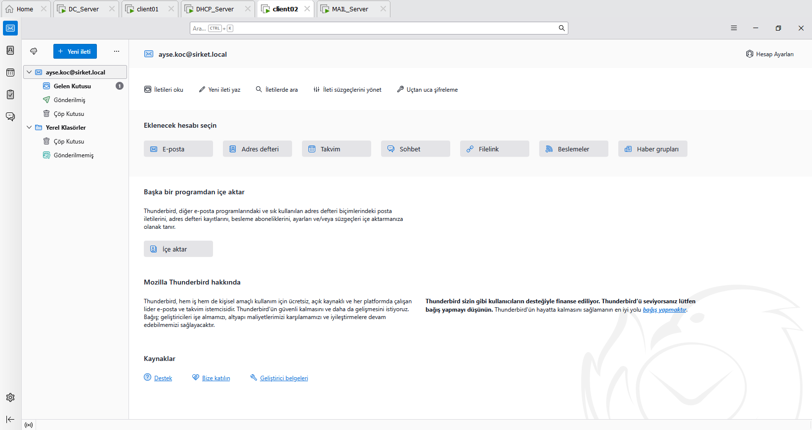
    </td>
    <td style="width: 50%; padding: 4px; border: none;">
      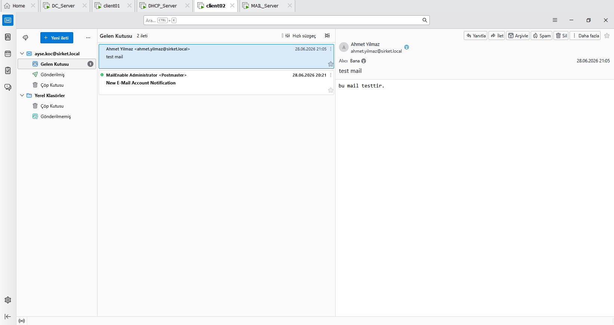
    </td>
  </tr>
</table>

**English:
To conduct realistic client-side mail delivery verifications, I selected Mozilla Thunderbird as the corporate desktop email application since no interface screenshots were captured during the deployment process. Since `sirket.local` is an internal private namespace, Thunderbird cannot automatically resolve configuration paths online, which requires a manual setup routine. I populated the endpoint profiles manually by routing incoming parameters to IMAP on port 143 and outgoing parameters to SMTP on port 25, mapping everything directly to the server's static IP address (`192.168.10.50`). During initial cross-department testing, I ran into a connectivity failure which I immediately debugged using `Test-NetConnection` and resolved by creating a Group Policy inbound firewall rule allowing ports 25, 110, 143, and 587 on the domain profile. As showcased in the examples, when IT staff `ahmet.yilmaz` logs in and fires an email, it routes smoothly across the network, landing instantly into the inbox of accounting user `ayse.koc`. This setup validates perfect access separation, proving that while everyone can access their own mailboxes securely, the backend routing functions exactly as intended.

**Türkçe:
İstemci tarafında gerçekçi e-posta gönderim testleri yürütebilmek amacıyla, kurulum aşamalarında ekran görüntüsü alamadığım için kurumsal masaüstü e-posta istemcisi olarak Mozilla Thunderbird uygulamasını kurarak işe başladım. `sirket.local` adresi dış dünyaya kapalı bir iç ağ uzantısı olduğundan, Thunderbird kurulum sihirbazı ayarları internetten otomatik çekemedi; bu nedenle manuel yapılandırma (Configure manually) adımlarını takip ettim. Hesap kurulum ayarlarında gelen sunucu için IMAP (port 143), giden sunucu için SMTP (port 25) protokollerini seçtim ve sunucu adresi olarak doğrudan mail sunucumun sabit IP adresini (`192.168.10.50`) tanımladım. İlk testler sırasında istemciden giden bağlantının engellendiğini gördüm; `Test-NetConnection` komutuyla yaptığım debug adımları sonrasında sorunun firewall kaynaklı olduğunu tespit edip, GPO üzerinden etki alanındaki bilgisayarlara 25, 110, 143 ve 587 portlarına izin veren bir gelen yönlü (Inbound) firewall kuralı basarak engeli kaldırdım. Ekrandaki örneklerde görüldüğü üzere, IT personeli `ahmet.yilmaz` hesabı ile oturum açıp bir mail gönderdiğinde e-posta ağ üzerinden sorunsuz akmakta ve muhasebe departmanındaki `ayse.koc` kullanıcısının gelen kutusuna anında düşmektedir. Bu durum, her personelin yalnızca kendi posta kutusunu görebildiği tam yetki izolasyonunu ve arka plandaki e-posta yönlendiricilerinin eksiksiz çalıştığını doğrulamaktadır.
